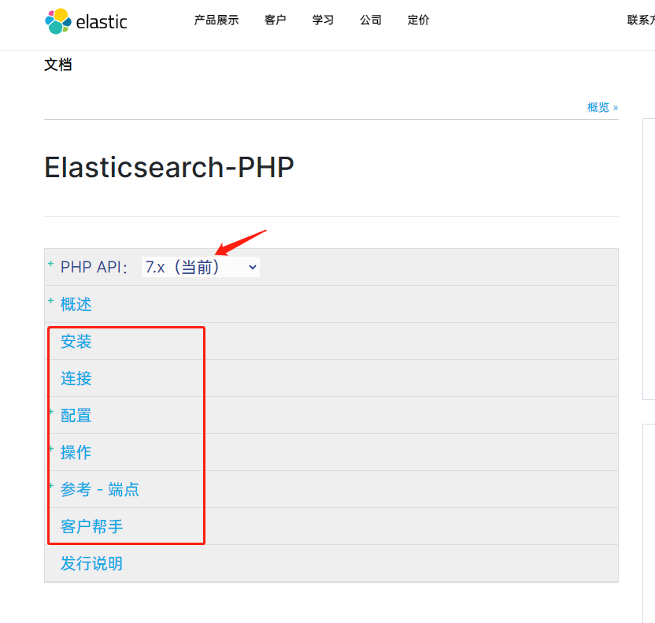
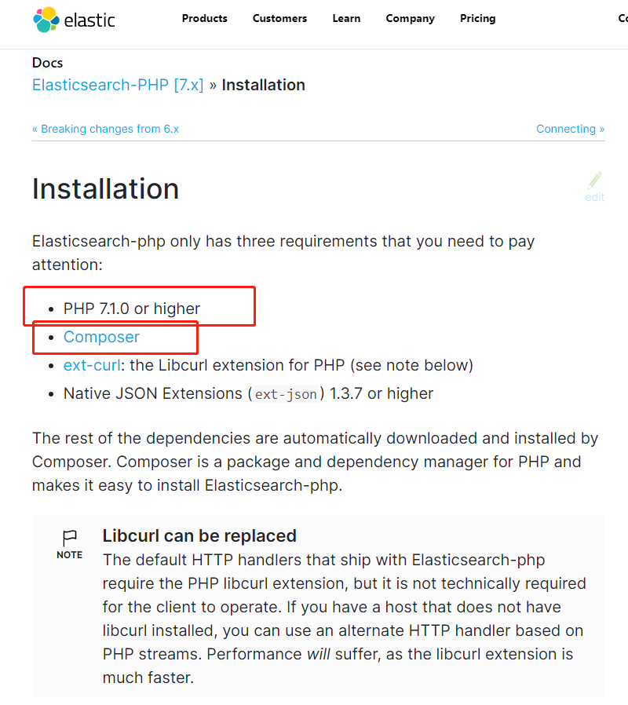
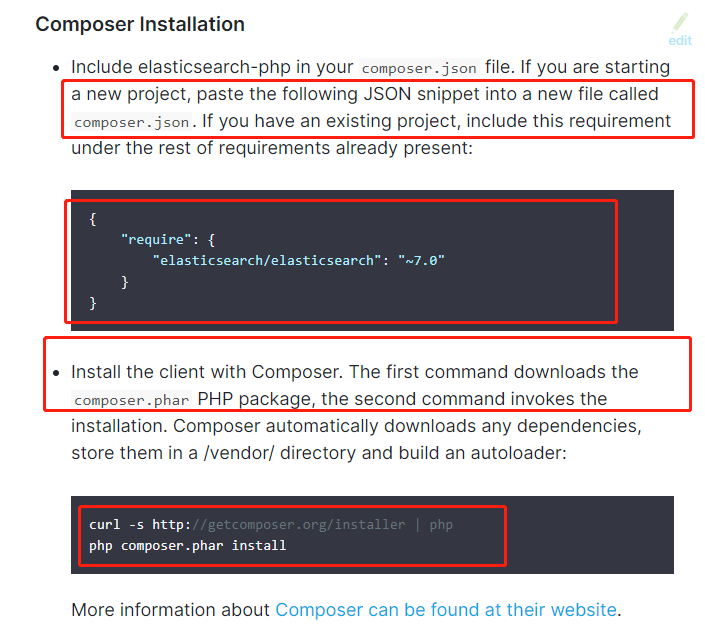
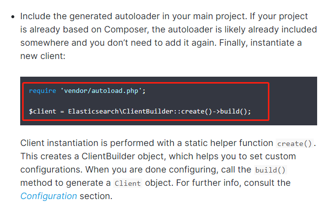
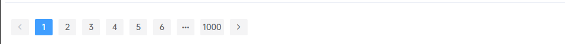

# ThinkPHP3项目构建与ES的使用

## 前言

为什么我用thinkphp去构建一个关于`ElasticSearch`的项目呢？因为简单~我感觉敏捷项目，使用`SpringBoot`去构建太麻烦了。有时候我需要快速赶出一个项目，我还是选择了`ThinkPHP`，简称`TP`。而且TP是一个快速、简单的基于MVC和面向对象的轻量级PHP开发框架。废话有点多了，哈哈，开干！

## ThinkPHP篇

### 目录结构

想要初始化一个tp版的`HelloWorld`，我们可以去官网下载

http://thinkphp.cn/down/framework.html

也可以去github下载

https://github.com/top-think/thinkphp

方法多的是，看你想用那个。

下载到你的`web`目录下，框架目录结构为

```
Application
├─Common         应用公共模块
│  ├─Common      应用公共函数目录
│  └─Conf        应用公共配置文件目录
├─Home           默认生成的Home模块
│  ├─Conf        模块配置文件目录
│  ├─Common      模块函数公共目录
│  ├─Controller  模块控制器目录
│  ├─Model       模块模型目录
│  └─View        模块视图文件目录
├─Runtime        运行时目录
│  ├─Cache       模版缓存目录
│  ├─Data        数据目录
│  ├─Logs        日志目录
│  └─Temp        缓存目录
```

在第一次访问应用入口文件的时候，会显示如图所示的默认的欢迎页面，并自动生成了一个默认的应用模块Home。


`应用入口文件`：就是你绑定的域名 或者 可以说你网站的访问地址。

### 调试模式

我们打开根目录下的`index.php`，可以看到有几行代码

```php
if(version_compare(PHP_VERSION,'5.3.0','<'))  die('require PHP > 5.3.0 !');

// 开启调试模式 建议开发阶段开启 部署阶段注释或者设为false
define('APP_DEBUG',True);

// 定义应用目录
define('APP_PATH','./Application/');

// 引入ThinkPHP入口文件
require './ThinkPHP/ThinkPHP.php';
```

ThinkPHP的运行模式包括调试模式和部署模式。默认情况下是运行在部署模式下面。部署模式下面性能优先，并且尽可能少地抛出错误信息，调试模式则以除错方便优先，关闭任何缓存，而且尽可能多的抛出错误信息，所以对性能有一定的影响。

部署模式采用了项目编译机制，第一次运行会对核心和项目相关文件进行编译缓存，由于编译后会影响开发过程中对配置文件、函数文件和数据库修改的生效（除非你修改后手动清空Runtime下面的缓存文件）。因此为了避免以上问题，我们强烈建议新手在使用ThinkPHP开发的过程中使用调试模式，这样可以更好的获取错误提示和避免一些不必要的问题和烦恼。

如果我们项目上线，改为`false`就可以了。

### 配置

每个项目都有一个独立的配置文件（位于项目目录的Application/Common/Conf/config.php），配置文件的定义格式均采用PHP返回数组的方式，例如：

```php
// 项目配置文件
 return array(
 '配置参数' => '配置值', 
 // 更多配置参数
 //...
 );
```

`配置值`可以支持包括`字符串、数字、布尔值和数组在内`的数据，通常我们建议配置参数均使用`大写`定义。如果有需要，我们还可以为项目定义其他的配置文件。

### 控制器

初次生成项目目录结构的时候，系统已经默认生成了一个默认控制器（就是之前看到的欢迎页面）。

```php
class IndexController extends Controller {
    public function index(){
        echo 'hello world';
    }
}
```

`控制器类命名规范：`模块名+Controller.class.php（模块名采用驼峰法并且首字母大写）。

### URL请求

URL访问方式有以下常用两种：

**入口文件/模块/控制器/操作**

```
http://localhost/index.php/Home/Index/index
```

**传三个参数**

```
http://localhost/index.php?m=Home&c=Index&a=index
```

而且访问时不需要区分大小写，无论URL是否开启大小写转换，模块名都会强制小写。

### 小结

更多关于ThinkPHP开发文档，可参考官网。

https://www.kancloud.cn/manual/thinkphp/1678

## ElasticSearch篇

那么如何在TP项目中引入ES呢？其实ES的官网已经告诉了我们。

### 集成ES库

打开ES官网-PHP客户端操作文档

https://www.elastic.co/guide/en/elasticsearch/client/php-api/current/index.html



我们可以按照官网的操作，一步步引入ES。



文档中，有要求，PHP的版本必须大于7.1.0或者更高。看清楚哦！是PHP版本，不是TP版本。

还有已经集成包管理工具 **Composer**，类似于`npm`。他会帮你安装一下你需要的库，方便你不用去网站到处找下载地址。

其余下面两个，我们安装的PHP都是支持的，不支持的，你想办法让它支持下就行。

继续跟着官网稳定走~



把你需要的es客户端类库，按照图中的内容格式，添加到你的`composer.json`中。然后curl，继续按照命令去操作。就把类库下载到你的`/vendor/xxx`目录中了。



然后在你项目中，引入它就行了。

我比较赶时间，没有去专门写一个ES的操作工具类。大家看看就行，可以根据自己的需要，去修改。

```php
<?php
namespace Home\Controller;
use Think\Controller;
use Think\Model;  
use think\Request;
require 'vendor/autoload.php'; 
use Elasticsearch\ClientBuilder;

class IndexController extends Controller {
    
    public function _initialize()
    {
        $hosts = ['http://localhost:8833'];
        $this->client = ClientBuilder::create()->setHosts($hosts)->build();
    }
    public function index(){
        print_r($this->client)
    }
```

### 增删改查

```php
//创建索引
//现在我们开始添加一个新的索引和一些自定义设置：
public function create_index() {
	$indexParams['index'] = 'myindex';
	//索引名称  
	$indexParams['type'] = 'mytype';
	//类型名称  
	$indexParams['body']['settings']['number_of_shards'] = 1;
	//当前只有一台ES，1就可以了
	$indexParams['body']['settings']['number_of_replicas'] = 0;
	//副本0，因为只有一台ES
	$this->client->create($indexParams);
}
//插入索引数据
public function add_document() {
	$params = array();
	$params['body'] = array(
	            'product_name' => '要插入的商品名称'，
	            'prodcut_id' => 5
	        );
	$params['index'] = 'myindex';
	//索引名称 
	$params['type'] = 'mytype';
	//类型名称  
	$params['id'] = '12345678';
	//不指定id，系统会自动生成唯一id  
	$ret = $this->client->index($params);
}
//删除索引
//由于 elasticsearch 的动态性质，我们添加第一个文档的时候自动创建了索引和一些默认设置。让我们删除这个索引，因为我们以后想要指定自己的设置：
public function delete_index() {
	$deleteParams['index'] = 'myindex';
	$this->client->indices()->delete($deleteParams);
}
//删除文档
public function delete_document() {
	$deleteParams = array();
	$deleteParams['index'] = 'myindex';
	$deleteParams['type'] = 'mytype';
	$deleteParams['id'] = '123';
	$retDelete = $this->client->delete($deleteParams);
}
//更改文档
public function update_document() {
	$updateParams = array();
	$updateParams['index'] = 'myindex';
	$updateParams['type'] = 'mytype';
	$updateParams['id'] = 'my_id';
	$updateParams['body']['doc']['product_name']  = '新商品名';
	$response = $this->client->update($updateParams);
}
//查询
public function search() {
	$searchParams['index'] = 'myindex';
	$searchParams['type'] = 'mytype';
	$searchParams['from'] = 0;
	$searchParams['size'] = 100;
	$searchParams['sort'] = array(
	            '_score' => array(
	                'order' => 'id'
	            )
	        );
	//相当于sql语句：  select * from hp_product where prodcut_name like '茶'  limit 0,100 order by id desc; 
	$searchParams['body']['query']['match']['product_name'] = '茶';
	$retDoc = $this->client->search($searchParams);
	echo '<pre>';
	print_r($retDoc);
	//相当于sql语句： select * from hp_product where product_name like '茶'  and product_id = 20 limit 200,10;  
	// $searchParams['body']['query']['bool']['must'] = array(  
	//     array('match' => array('product_name' => '茶')),  
	//     array('match' => array('product_id' => 20))  
	//    );  
	// $searchParams['size'] = 10;  
	// $searchParams['from'] = 200;  
	// 
	//  
	// 当于sql语句：select * from hp_product where product_name like '茶' or product_id = 20 limit 200,10; 
	// $searchParams['body']['query']['bool']['should'] = array(  
	//        array('match' => array('product_name' => '茶')),  
	//        array('match' => array('product_id' => 20))  
	//      );  
	//$searchParams['size'] = 10;  
	//$searchParams['from'] = 200; 
	//
	//
	// 当于sql语句： select * from hp_product where product_name like '茶' and product_id != 20 limit 200,10; 
	// $searchParams['body']['query']['bool']['must_not'] = array(  
	//        array('match' => array('product_name' => '茶')),  
	//        array('match' => array('product_id' => 20))  
	//      );  
	//$searchParams['size'] = 10;  
	//$searchParams['from'] = 200; 
	//
	//
	//当于sql语句：select * from hp_product where id>=20 and id<30  limit 200,10; 
	// $searchParams['body']['query']['range'] = array(  
	//        'id' => array('gte' => 20,'lt' => 30);  
	//      );  
	//$searchParams['size'] = 10;  
	//$searchParams['from'] = 200;
}
//获取文档
public function get_document() {
	$getParams = array();
	$getParams['index'] = 'myindex';
	$getParams['type'] = 'mytype';
	$getParams['id'] = '12344';
	$retDoc = $this->client->get($getParams);
	print_r($retDoc);
}
```

### 多条件查询

看这篇文章就足够了~

[文章地址](https://www.cnblogs.com/NaughtyBaby/p/9942896.html)

### 分页查询

```php
public function testClient() {
	$name = $_POST['name'];
	//姓名
	$tel = $_POST['tel'];
	//手机号
	$card_number = $_POST['card_number'];
	//证件号
	//构造查询条件
	$matches=[];
	if($name) array_push($matches,['match'=>['name'=>$name]]);
	if($tel) array_push($matches,['match'=>['tel'=>$tel]]);
	if($card_number) array_push($matches,['match'=>['card_number'=>$card_number]]);
	$page = $_POST['page']?$_POST['page']:1;
	//页码
	$size = 10;
	//每页显示条数
	$limit = ($page-1)*$size;
	//偏移量
	$params=[
	            'index'=>'people_information',
	            'type'=>'_doc',
	            'from'=>$limit, //偏移量
	'size'=>$size, //每页显示条数
	'body'=>[
	                    'query'=>[
	                        'bool'=>[
	                            "must"=>$matches
	                        ]
	                    ],
	                    '_source'=>['name','birth','card_number','sex','address','tel'],
	                    'highlight'=>[
	                        'pre_tags'=>"<p class='key' style='color:red'>",
	                        'post_tags'=>"</p>",
	                        'fields'=>[
	                            "*" => new Highlighter()
	                        ]    
	                    ]
	                ]
	        ];
	$results = $this->client->search($params);
	//循环处理数据，将高亮显示的字段替换到原数据
	foreach ($results['hits']['hits'] as $k => $v) {
		if($v['highlight']['name']) $results['hits']['hits'][$k]['_source']['name'] = $v['highlight']['name'][0];
		if($v['highlight']['tel']) $results['hits']['hits'][$k]['_source']['tel'] = $v['highlight']['tel'][0];
		if($v['highlight']['card_number']) $results['hits']['hits'][$k]['_source']['card_number'] = $v['highlight']['card_number'][0];
	}
	//从二维数组中取出一列
	$list = array_column($results['hits']['hits'], '_source');
	$arr['current_page'] = $page;
	//当前页
	$last_page = ceil($results['hits']['total']['value']/$size);
	//总页数
	$arr['last_page'] = $last_page;
	$arr['prev_page'] = $page -1 <= 1 ? 1 : $page - 1;
	//上一页
	$arr['next_page'] = $page +1 >= $last_page ? $last_page : $page+1;
	//下一页
	$arr['total']=$results['hits']['total']['value'];
	//总记录数
	$arr['data'] = $list;
	//展示的数据
	$this->ajaxReturn($arr,'JSON');
}
```

然后前端我是使用的`ElementUI`提供的分页组件

代码如下：

`Template`

```html
<el-table
      :data="tableData"
      v-loading="loading"
      element-loading-text="拼命查询中"
      element-loading-spinner="el-icon-loading"
      element-loading-background="rgba(0, 0, 0, 0.8)"
      style="width: 100%">
      <el-table-column
        prop="name"
        label="姓名"
        width="180">
          <template slot-scope="scope">
              <div class="highlight" v-html='scope.row.name'></div>
          </template>
      </el-table-column>
      <el-table-column
        prop="sex"
        label="性别"
        width="180">
      </el-table-column>
      <el-table-column
        prop="address"
        label="地址">
      </el-table-column>
      <el-table-column
        prop="birth"
        label="出生日期">
      </el-table-column>
      <el-table-column
        prop="card_number"
        label="证件号">
        <template slot-scope="scope">
              <div class="highlight" v-html='scope.row.card_number'></div>
        </template>
      </el-table-column>
      <el-table-column
        prop="tel"
        label="联系方式">
        <template slot-scope="scope">
              <div class="highlight" v-html='scope.row.tel'></div>
        </template>
      </el-table-column>
    </el-table>
    
    <br>
    
    <el-pagination
      background
      layout="prev, pager, next"
      :total="resultsCount"
      :current-page.sync="currentPage"
      @current-change="handleCurrentChange" :hide-on-single-page="resultsCount==0">
    </el-pagination>
```

`JS`

```php
getMsg(page=1){
              axios.post('/index.php/Home/index/testClient',this.ruleForm,{
                transformRequest:[
                    function(data){
                        let params = '';
                        for(let index in data){
                            params +=index+'='+data[index]+'&';
                        }
                        params +='&page='+page
                        return params;
                    }]
                }).then(res=>{
                    if(res.data.code==0){
                        this.$notify.error({
                          title: '错误',
                          message: res.data.msg
                        });
                        this.loading=false
                        return
                    }
                    this.tableData=res.data.data
                    this.resultsCount=res.data.total
                    this.currentPage=page
                    this.loading=false
                });
          },
          handleCurrentChange(val) {
              this.loading=true
              this.getMsg(val)
          },
        }
```

效果如下：



### 高亮显示

搜索高亮显示，方便用户的阅读。也是在搜索项目中最常用最基础的功能需求。

想实现`高亮`，需要先安装`nunomaduro/collision`。

切换到TP项目的根目录下，

```shell
composer require nunomaduro/collision
```

后端代码：

```php
public function search(Request $request) {
	$param = $request->param('music');
	$params = [
	            'index' => 'uploads',
	            'body'  => [
	                'query' => [
	                    'multi_match' => [
	                        'query' => $param,
	                        'fields' => ['music','video']
	                    ]
	                ],
	                'highlight' => [
	                    'fields' => [
	                        "*" => new Highlighter()
	                    ]
	                ]
	            ]
	        ];
	$response = $this->es->search($params);
	print_r($response);
}
```

前端代码：

```css
em : {color : red}
```

我们也可以在后端设置，`highlight`-`高亮块`的包裹标签，比如这样：

```php
$params=[
            'index'=>'people_information',
            'type'=>'_doc',
            'from'=>$limit, //偏移量
'size'=>$size, //每页显示条数
'body'=>[
                    'query'=>[
                        'bool'=>[
                            "must"=>$matches
                        ]
                    ],
                    '_source'=>['name','birth','card_number','sex','address','tel'],
                    'highlight'=>[
                        'pre_tags'=>"<p class='key' style='color:red'>",
                        'post_tags'=>"</p>",
                        'fields'=>[
                            "*" => new Highlighter()
                        ]    
                    ]
                ]
        ];
```

这样就OK了。

