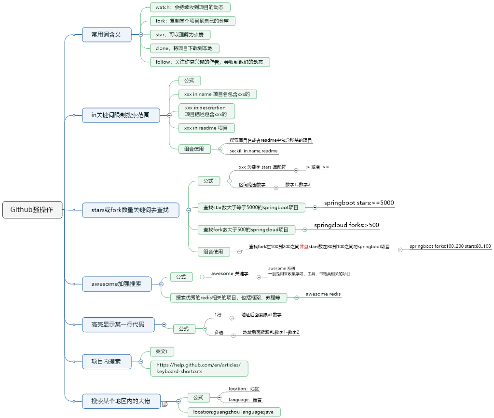

# github如何精确搜索项目

1.常用词含义    

watch：会持续收到项目的动态    

fork：复制某个项目到自己的仓库    

star：可以理解为点赞    

clone：将项目下载到本地    

follow：关注你感兴趣的作者，会收到他们的动态 

2.in关键词限制搜索范围 

（1）公式    

xxx in:name 项目名包含xxx的    

xxx in:description 项目描述包含xxx的   

 xxx in:readme 项目 

（2）case    

搜索项目名或者readme中包含秒杀的项目        

seckill in:name,readme     

3.stars或fork数量关键词去查找 

（1）公式    

:> 或者 :>=    

数字1..数字2 

（2）case    

查找star数大于等于5000的springboot项目        

springboot stars:>=5000    

查找fork数大于500的springcloud项目       

springcloud forks:>500    

查找fork在100到200之间并且stars数在80到100之间的springboot项目        springboot forks:100..200 stars:80..100 

4.awesome加强搜索 

（1）公式    

awesome 关键字       

 awesome 系列一般是用来收集学习、工具、书籍类相关的项目 

（2）case    

搜索优秀的redis相关的项目，包括框架、教程等        

awesome redis 5.高亮显示某一行代码    

地址后面紧跟#L数字    

地址后面紧跟#L数字1-数字2 

6.项目内搜索    

英文t    

https://help.github.com/en/articles/keyboard-shortcuts 

7.搜索某个地区内的牛逼人物 

（1）公式    

location：地区    language：语言 

（2）case    

location:guangzhou language:java