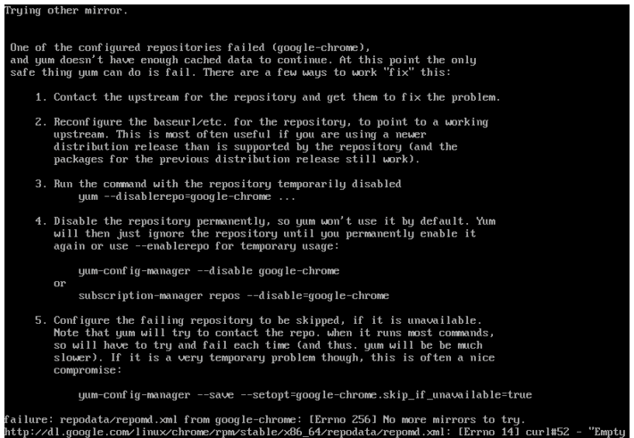

# CentOS7安装Chrome后yum不可以使用的解决方法



> http://dl.google.com/linux/chrome/rpm/stable/x86_64/repodata/repomd.xml: [Errno 14] curl#52 - “Empty reply from server”

这句话让我想起了可能是因为刚安装的chrome导致的。

最后参考了别人的解决方法：

```shell
rm -rf /etc/yum.repos.d/google-chrome.repo

yum clean all
```