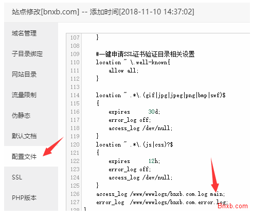
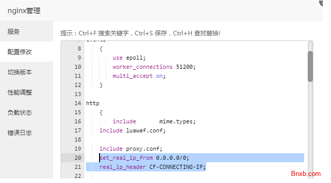

# PHP开发获取Cloudflare传递的真实访客IP

在某些场景下，需要限制同IP下客户注册账号数量等等...

用户可以通过修改修改请求头，伪造请求ip，这就很烦人

然后我们再套个cdn更获取不到真实的访问ip

我翻了很多的贴子，终于找到了一份有用的解决方法。

## 解决方法

先看看我们通过PHP 得到的CF返回来的HEADER信息

```php
<?php
print_r($_SERVER); 
?>
```

读取到的结果如下：

```
Array
(
    [USER] => www
    [HOME] => /home/www
    [HTTP_CF_CONNECTING_IP] => 122.114.6.211
    [HTTP_COOKIE] => __cfduid=*****; PHPSESSID=******; PHPSESSID=*****; Hm_lvt_***=****; Hm_lpvt_*****=1536121476
    [HTTP_ACCEPT_LANGUAGE] => zh-CN,zh;q=0.9
    [HTTP_ACCEPT] => text/html,application/xhtml+xml,application/xml;q=0.9,image/webp,image/apng,*/*;q=0.8
    [HTTP_USER_AGENT] => Mozilla/5.0 (Windows NT 6.1; Win64; x64) AppleWebKit/537.36 (KHTML, like Gecko) Chrome/68.0.3440.106 Safari/537.36
    [HTTP_UPGRADE_INSECURE_REQUESTS] => 1
    [HTTP_CF_VISITOR] => {"scheme":"https"}
    [HTTP_X_FORWARDED_PROTO] => https
    [HTTP_CF_RAY] => 455d1c72ed0e963d-SJC
    [HTTP_X_FORWARDED_FOR] => 122.114.6.211
    [HTTP_CF_IPCOUNTRY] => CN
    [HTTP_ACCEPT_ENCODING] => gzip
    [HTTP_CONNECTION] => Keep-Alive
    [HTTP_HOST] => cdn.bnxb.com
    [PATH_INFO] => 
    [REDIRECT_STATUS] => 200
    [SERVER_NAME] => cdn.bnxb.com
    [SERVER_PORT] => 443
    [SERVER_ADDR] => *
    [REMOTE_PORT] => 12554
    [REMOTE_ADDR] => 172.68.132.93
    [SERVER_SOFTWARE] => nginx/1.14.0
    [GATEWAY_INTERFACE] => CGI/1.1
    [HTTPS] => on
    [REQUEST_SCHEME] => https
    [SERVER_PROTOCOL] => HTTP/1.1
    [DOCUMENT_ROOT] => /
    [DOCUMENT_URI] => /ip.php
    [REQUEST_URI] => /ip.php
    [SCRIPT_NAME] => /ip.php
    [CONTENT_LENGTH] => 
    [CONTENT_TYPE] => 
    [REQUEST_METHOD] => GET
    [QUERY_STRING] => 
    [SCRIPT_FILENAME] => /ip.php
    [FCGI_ROLE] => RESPONDER
    [PHP_SELF] => /ip.php
    [REQUEST_TIME_FLOAT] => 1536196806.1434
    [REQUEST_TIME] => 1536196806
)
```

其中HTTP_CF_CONNECTING_IP标头就是我们要的访客真实IP信息了。

接下来说一下NGINX和PHP分别如何获取这个IP?

**1、NGINX配置获取CloudFlare 下的访客真实IP并记录到日志**需要修改NGINX的配置文件

宝塔的nginx配置文件存放位置与一般nginx不一样。

宝塔存放nginx配置文件位置:/www/server/nginx/conf/nginx.conf；

一般nginx的配置文件位置:/usr/local/nginx/conf/nginx.conf。

在

```
http{

}
```

部分增加

```
map $HTTP_CF_CONNECTING_IP  $clientRealIp {
    ""    $remote_addr;
    ~^(?P<firstAddr>[0-9.]+),?.*$    $firstAddr;
}
log_format  main  '$clientRealIp [$time_local] "$request" '
                  '$status $body_bytes_sent "$http_referer" '
                  '$http_user_agent $remote_addr $request_time';
```

主要是为了通用性，如果关闭了CDN，可以不需要修改获取IP的方式，所以才这么修改，不然直接用$HTTP_CF_CONNECTING_IP就行了（这个时候就不需要在日志格式里使用$clientRealIp）

然后在网站记录的日志定义使用main这个日志格式

比如

```
access_log  /www/wwwlogs/www.bnxb.com.log main;
```

可以参考https://www.bnxb.com/nginx/27513.html



另外还有一种更简单的方法，但是如果服务器上有其他站点没套CF，可能就获取会异常。

就是在NGINX的主配置文件中加入

```
set_real_ip_from 0.0.0.0/0;
real_ip_header CF-CONNECTING-IP;
```

如下图：



**2、PHP获取使用CloudFlare CDN环境下的访客真实IP**

```php
<?php
$realip =$_SERVER['HTTP_CF_CONNECTING_IP']; 
echo $realip;
//也可以用下面这个
$clientIP = isset($_SERVER['HTTP_CF_CONNECTING_IP']) ? $_SERVER['HTTP_CF_CONNECTING_IP'] : $_SERVER['REMOTE_ADDR'];
echo $clientIP;
?>
```

因为我的项目是php的，所以我就选择了第二种最简单的方法。

下方来源有，Cloudflare配合宝塔nginx防火墙防御CC攻击的，我的站加了CDN就没被打死过，一切归功于Cloudflare和nginx防火墙。

下方来源的方法，我还没有亲测过。有机会了，可以测试一下。看效果和nginx防火墙默认防御策略有何不同。

参考来源：

https://www.bnxb.com/php/27592.html