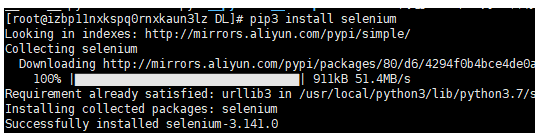

# 在Linux下使用selenium+ Chrome + Chromedriver

## 1.安装selenium 

```shell
pip3 install selenium 
```



## 2.安装chrome

  用下面的命令安装Google Chrome

```shell
yum install https://dl.google.com/linux/direct/google-chrome-stable_current_x86_64.rpm
```

  安装必要的库

```shell
yum install mesa-libOSMesa-devel gnu-free-sans-fonts wqy-zenhei-fonts
```

## 3、安装 chromedriver

查看安装谷歌浏览器办版本号:

```shell
google-chrome --version
```

查看相应版本的谷歌浏览器对应的驱动版本

http://chromedriver.storage.googleapis.com/index.html

下载后，解压。

```
unzip chromedriver_linux64.zip
 
mv chromedriver /usr/bin/
```

## 4、运行代码，查看是否成功（python下）

 进入ipython环境或者直接python3

```python
python3
 
from selenium import webdriver
from selenium.webdriver.chrome.options import Options
chrome_options = Options()
chrome_options.add_argument('--no-sandbox')
chrome_options.add_argument('--disable-dev-shm-usage')
chrome_options.add_argument('--headless')
browser = webdriver.Chrome(options=chrome_options)
 
'''
其他提高性能参数
'''
chrome_options.add_argument('blink-settings=imagesEnabled=false')
chrome_options.add_argument('--disable-gpu')
 
```

其中
“–no-sandbox”参数是让Chrome在root权限下跑
“–headless”参数是不用打开图形界面

注意一定要设置无界面，不然会报错

```shell
selenium.common.exceptions.WebDriverException: Message: unknown error: Chrome failed to start: exited abnormally
  (unknown error: DevToolsActivePort file doesn't exist)
  (The process started from chrome location /usr/bin/google-chrome is no longer running, so ChromeDriver is assuming that Chrome has crashed.)
```

## 5.如果报错:

```shell
(Driver info: chromedriver=2.41.578700 (2f1ed5f9343c13f73144538f15c00b370eda6706),platform=Linux 3.10.0-957.5.1.el7.x86_64 x86_64)
```

## 原因：

1.chromedriver没有安装

2.chromedriver的版本和chrom浏览器的版本不对应

因为我们已经安装过了，所以很明显是原因2，所以自己去找到和谷歌浏览器相应的chromedriver吧.