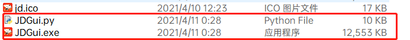

# 【python】pyinstaller打包exe，程序无需python环境亦可运行

我经常用python写一些脚本，比如爬虫、数据处理、模拟点击等等。有时候身边的朋友也会向我索取，独乐乐不如众乐乐。但是python构建的程序，需要特定的python环境才能运行，而且python版本之间相差也很大，有时候还需要通过pip安装一些依赖，总之一个字“麻烦”。

`pyinstaller` ，一款很不错的打包工具。可以把编写的python程序代码，一键打包成exe文件。总之我用起来很舒服。

## 安装pyinstaller

1、安装过程非常简单，一行命令。

```shell
pip install pyinstaller
```

## 打包为exe程序

1、接下来就可以直接打包了。

```shell
pyinstaller -F main.py
```

执行完命令后，会生成几个文件夹，pycache，dist，build

其中`dist` 文件夹中就是生成的exe文件。直接就可以在windows系统下运行了。

如果你不相信的话，可以发到你朋友的电脑上（他没有python环境的前提下），进行测试。

2、但是我们会发现运行`exe程序`的时候，会弹出一个`dos窗口`，是不是很不爽呢？其实我们在打包的时候，添加参数`-w`，就可以隐藏dos窗口了。那我们就开始重新打包一遍？

```shell
pyinstaller -F -w main.py
```

3、但是我们有么有发现，打包后的程序，图标是


很丑，很丑，特别丑呢？？？

那怎么替换呢？还是加参数

```shell
pyinstaller -F -w -i logo.ico main.py
```

这会我们打开自己打包的exe程序，注意看左上角的图标，依旧是默认的tk图标（小羽毛），

我还是不太喜欢这图标，那怎么办呢？？？

```python
window.iconbitmap('jd.ico')  # 更改窗口图标
```

然后再打包，命令跟之前一样

```shell
pyinstaller -F -w -i logo.ico main.py
```

但是打包后，图标需和exe程序，目录保持一致。


当然你想改目录也可以。修改这句代码就可以实现。

```python
window.iconbitmap('xxx文件夹/yyy文件夹/jd.ico')  # 更改窗口图标
```

## 如何防止别人轻松反编译自己的源代码

pyinstaller，自带了自己的加密方式，只需要`--key=123456`就可以实现。这种方式只能在一定程度上防止别人轻松的脱你的壳，解你的密。作用一点点吧，具体的硬核操作，稍后我也许会说到。

```shell
pyinstaller -F  -i jd.ico --clean -w  --key 123456  JDGui.py
```

**这里的clean，我只是为了清除缓存后打包，防止缓存仍存在，打包后，程序功能存在异常**

## 加餐

最后附上pyinstaller常用的几个参数，可以减少大家爬帖子浪费的时间。

| 参数       | 含义                                                         |
| ---------- | ------------------------------------------------------------ |
| -F         | 打包单个文件，生成结果是一个exe文件，如果代码都写在一个.py文件时使用，项目有多个文件时不要使用 |
| -i         | 指定程序的图标                                               |
| -w         | 不显示dos窗口（命令行）                                      |
| -c         | 显示dos窗口（命令行）                                        |
| -h         | 显示帮助                                                     |
| -v         | 显示版本号                                                   |
| --key=密码 | 加密打包                                                     |

**不过，我感觉pyinstaller打包，有一个缺点，本来一个几十kb的代码文件，经过打包后，竟然有10多Mb**



