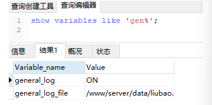
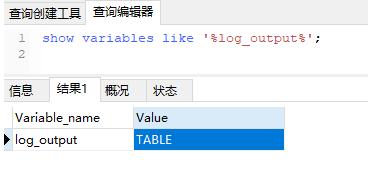
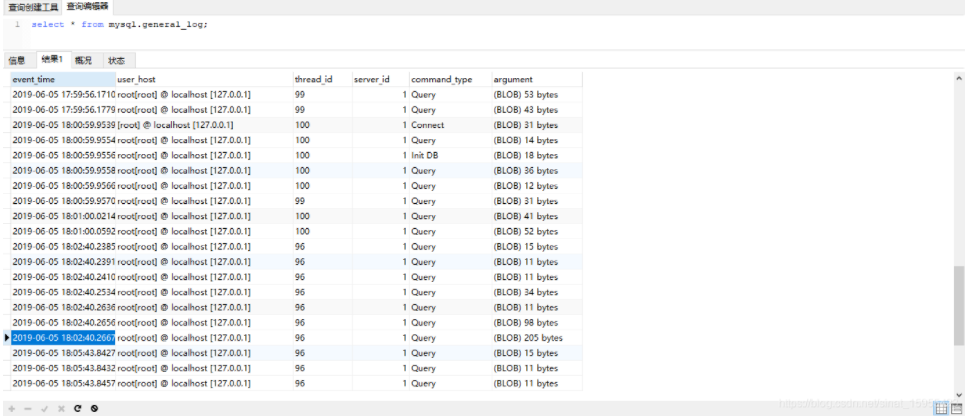

# mysql如何查看操作记录

分为文件记录日志和数据库记录日志两种方式，效果相同。

## 一 、文件记录数据库操作日志

首先进入mysql输入指令，是先进入root数据库，否则会提示没权限。

然后再进需要开启日志的数据库。

```mysql
show variables like 'gen%';
```



general_log是开启还是关闭状态，以及这个帐号的general_log文件在哪。
如果没有开启，请先设置开启。

```mysql
set global general_log=ON;
```

然后去路径在看日志就ok了。

查看log：

```shell
cat /目录/日志.log
```

## 二 、数据库自己记录操作日志

```mysql
show variables like '%log_output%';
```



默认是FILE，改为TABLE

```mysql
set  global log_output='TABLE';
```

之后就可以通过以下两句话查看数据库操作记录。

查看操作记录：

```mysql
select * from mysql.general_log;
```

会看到在数据库里已经记录上了日志



因数据库一直记录日志会增加压力，建议用文件记录

```mysql
set  global log_output='FILE';

truncate table mysql.general_log;
```

最后附上MySQL8.0的修改数据库密码：

```mysql
ALTER USER 'root'@'localhost' IDENTIFIED WITH mysql_native_password BY 'new密码';  
```