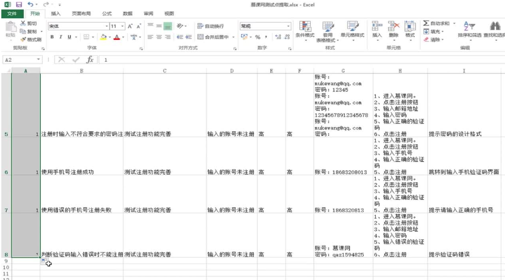

## 前置知识

**软件**：数据+程序+文档

> 测试时就是操作数据，操作的主体就是程序，文档就是工作时的可视化。

**软件测试的基础**：软件测试就是以软件需求为目的，保证软件质量的手段。

**测试流程**：需求分析->制定计划->编写用例与执行->对测试结果的分析报告。

**测试的生命周期**：测试计划，测试设计，测试开发，测试执行，测试评估。

---

黑盒、灰盒、白盒、功能、性能、安全、兼容性、易用性、UI元素

**按照测试手段划分：**

>* 黑盒 ：软件比作一个黑色的盒子，不知道盒子里面的内部结构只能够通过外面所暴露出来的接口进行测试。 
>* 灰盒 ：就是把软件比作一个半透明的盒子，可以看到里面少部分的东西，所以可以通过暴露的功能和盒子内部的数据进行对比得出测试结论。比如测试一个订单生成的功能就可以通过软件上生成的订单和数据库里的数据进行对比内外是否一致。 
>* 白盒 ：把软件看成一个透明的盒子通过观察内部的结构直接推销出是否满足用户的需求，白盒测试时这三种测试中技术难度最高的一种。

**按照专项测试方向划分:**

>* 功能  ：功能测试就是验证是否满足用户提出的软件需求。 
>* 性能  ：就是测试软件的一个工作效率。 
>* 安全  ：安全测试就是是否能够保护用户的信息而被轻易的盗取，而获取一下非法的利益

**按照测试点划分：**

>* 兼容性：测试软件在不同平台上的表现。 
>* 易容性：测试软件是否友好满足用户的使用习惯。 
>* UI元素：检测软件的界面布局是否一致，美观。

## 测试用例包含哪些内容？

用例编号：相当于我们的身份证号，具有唯一性

用例名称：用例的名字，要求言简意赅

测试背景：这条用例主要测试什么东西

前置条件：执行这条措施之前应该先执行什么条件，比如测试登录功能，前提是要有账号密码。

优先级：测试用例的优先程度

重要级：测试用例的重要程度

测试数据：比如输入的账号密码，鼠标的操作也是一种测试数据

测试步骤：测试进行的步骤

预期结果：对应输入数据或条件等得到对应的现象

实际结果：测试执行后的结果

备注：其他特殊情况的信息。

> 优先级跟重要级不是成正比存在的，它们没有一定的关系，比如周末了计划出去玩出去玩对于我来说就优先级排在最高，但是突然公司让我去加班，然后我肯定会选择去加班而不是去玩所以优先级跟重要级不是一定成正比关系存在的。

**测试用例编写流程：**

需求分析——》提取测试点——》测试用例编写——》测试用例评审

## 需求分析与测试点编写

一、需求分析（一般由产品经理完成）

>* 业务需求：关注系统是否满足业务
>* 用户需求：关注系统是否满足用户习惯
>* 功能需求：关注系统是否满足功能要求

二、如果没有需求怎么办？

参考市面上已经上线的同类产品

三、如果需求模糊怎么办？

收集整理已有的需求，不明白的地方提出来，逐条找相关人员（产品经理/项目经理）确认，或还是参考同类型产品的实现情况。

## 提取测试点

一、什么是测试点？

测试点即通过需求分析后对得出的需要进行测试的具体内容。

二、测试点对设计测试用例有什么好处？

>* 快速：根据测试点快速设计测试用例
>* 覆盖：测试点完全覆盖需求
>* 方法：迅速找到设计测试用例的方法
>* 细节：展现需求细节

三、如何提取测试点？

1、按照操作顺序

2、按照对应顺序的功能模块

3、根据以上两点获得的测试点用等价类划分、功能需求等方式精简、再归类。

四、提取测试点案例：

## 测试用例的编写方法

一、测试用例编写注意以下几点：

>* 根据项目的实际情况设计测试用例表格
>* 用例格式不是固定的，不要生搬硬套
>* 根据具体的情况编写

二、测试用例编写的方法：

1、等价类划分法：

如何选择适当的数据子集，来代表整个数据集。通过降低测试的数据去实现“合理的”覆盖，覆盖了更多的可能数据，以发现更多的软件缺陷。

2、边界值分析法：

使用边界值分析方法设计测试用例时一般与等价类划分结合起来，但它不是从一个等价类中任选一个例子作为代表，而是将测试边界情况作为重点目标，选取正好等于、刚刚大于或刚刚小于边界值得测试数据。

3、场景法：

通过运用场景来对系统的功能点或业务流程的描述，从而提高测试效果。场景法一般包含基本流和备用流，从业一个流程开始，通过描述经过的路径来确定的过程，经过遍历所有的基本流和备用流来完成整个场景。

4、猜测法：

根据直觉、经验选择容易出错的地方。

## 慕课网注册功能测试用例编写实战

> 测试用例中可加入：
> 所属模块、测试环境（谷歌浏览器、QQ浏览器、安卓手机、苹果手机、windows电脑、苹果电脑、linux电脑）、所属版本。

## 测试用例的评审

一、评审的意义在哪里？

>* 通过评审可以发现测试用例的不足
>* 方便测试人员改进用例
>* 达到测试时提高测试质量的目的

二、评审的流程是怎么样的？

> 流程：评审流程不是一次性的。是一个持续的过程，直到用例改善完毕为止。

## 测试用例的管理

一、为什么需要管理用例？

1、测试用例数量巨大

2、测试用例会随着需求变更

3、测试用例需要补充完善

二、如何管理用例？

1、原始的excel管理方式

2、专业的项目管理系统

三、项目管理系统有哪些？

>禅道属于成本低，性价比较高者，易于操作管理。完全支持敏捷开发流程，拥有完整的软件生命周期管理，是专业的研发项目管理软件。

四、禅道演示：

## 总结：

1、掌握了测试用例基本内容项

2、了解，学习项目管理工具（测试用例）——禅道的使用。