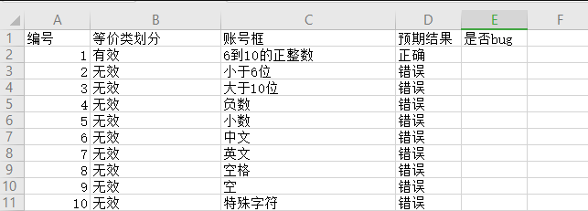
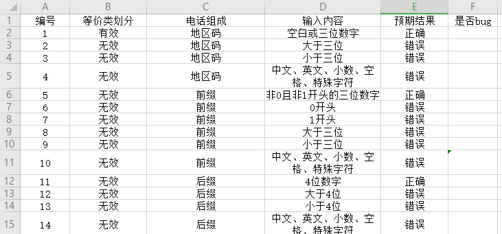
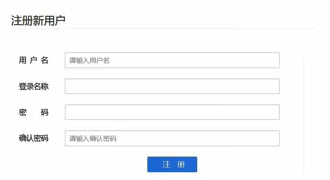
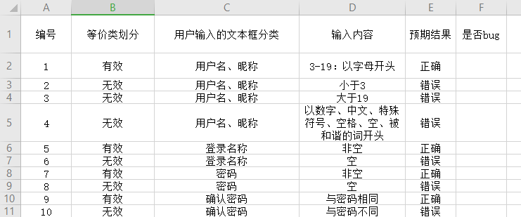

# 等价类分类实战之QQ账号和手机号案例

## 案例一

测试QQ账号，账号的要求是6--10位的正整数

有效等价类：

​	1：长度在6--10位之间的整数

无效等价类：

​	1：长度小于6

​	2：长度大于10

​	3：负数

​	4：小数

​	5：英文字母

​	6：中文

​	7：空格

​	8：特殊字符

### 编写用例测试

## 案例二

某城市电话号码是由三部分组成，分别是

地区码：空白或是3位数字

前缀：非0且非1开头的三位数字

后缀：4位数字

### 编写用例测试

## 案例三

-用户名（昵称）长度为3-19：以字母开头

-登录名称：非空

-密码：非空

-确认密码：值和密码相同

### 编写用例测试

##  等价类分类总结

当我们在测试文本框的程序可以考虑如下的情况:

> * 文本框要求输入的长度
> * 输入的类型
> * 组成规则
> * 是否为空
> * 是否区分大小写
> * 是否去除空格