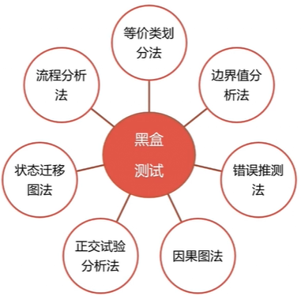
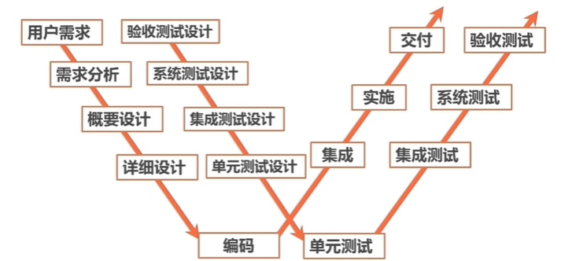

# 一文搞懂软件测试有哪些方法？

## 按测试阶段来分类

> * 单元测试
> * 集成测试
> * 系统测试
> * 验收测试

### 单元测试

对软件中的**最小可测试单元**进行检查和验证。

####  单元测试的原则

> * 1、尽可能保证各个测试用例是互相独立的。
>
>   避免调用其他模块中的函数等等，否则不容易判断哪个模块出问题。
>
> * 2、一般由代码的开发人员来实施，用以校验所开发的代码功能符合自己的设计要求。

#### 单元测试的益处

> * 能尽快发现缺陷。
> * 有利于重构。
> * 简化集成。
> * 文档。
> * 用于设计。

#### 单元测试的限制

> * 1、不可能覆盖到所有的执行路径，所以不可能保证捕捉到所有路径的错误。
> * 2、每一行代码，一般需要3~5行测试代码才能完成单元测试。所以存在投入和产出的一个平衡。

#### 单元测试框架

> * java: JUnit 
> * .net: nunit 
> * PHP: PHPUnit  
> * C++: CppUnit

### 集成测试

**是在单元测试的基础上，测试在将所有的软件单元按照概要设计规格说明的要求组装成模块、子系统或系统的过程中各部分工作是否达到或实现相应技术指标及要求的活动。**

####  集成测试的主要实施方案

> * Big Bang （大爆炸式集成）
> * 自顶向下 
> * 自底向上 
> * 核心系统集成 
> * 高频集成（高频率进行测试）

#### 集成测试 & 单元测试的区别

> * 1、测试的对象不同
>   * 集成测试针对于模块；
>   * 单元测试针对于最小单元。
> * 2、测试的依据不同
>   * 集成测试主要依据是针对软件的概要设计；
>   * 单元测试主要依据是针对软件的详细设计。
> * 3、测试的方法不同
>   * 集成测试主要关注的是模块之间接口的集成；
>   * 单元测试主要关注的是单元的内部。

### 系统测试

**定义：是将经过集成测试的软件，作为计算机系统的一部分，与系统中其他部分结合起来，在实际运行环境下对计算机系统进行的一系列严格有效的测试，以发现软件潜在的问题，保证系统的正常运行。**

#### 系统测试的关注点

> * 关注系统本身的使用
> * 关注系统与其他相关系统间的连通
> * 关注系统在不同使用压力下的表现（并发、cpu）
> * 关注系统在真实使用环境下的表现

#### 系统测试 & 集成测试的区别

> * 1、测试对象不同
>   * 集成测试：由通过了单元测试的各个模块所集成起来的构件；
>   * 系统测试:除了软件之外，还包括计算机硬件及相关的外围设备、数据采集和传输机构、支持软件、系统操作人员等整个系统。
> * 2、测试时间不同
>   * 集成测试介于单元测试和系统测试之间测试；
>   * 系统测试在集成测试之后。
> * 3、测试内容不同
>   * 集成测试∶各个单元模块之间的接口；
>   * 系统测试∶整个系统的功能和性能。
> * 4、测试角度不同
>   * 集成测试∶偏于技术角度的验证；
>   * 系统测试∶偏于业务角度的验证。

### 验收测试

**定义：也称交付测试。针对用户需求、业务流程的正式的测试，确定系统是否满足验收标准，由用户、客户或其他授权机构决定是否接受系统。**

####  验收测试细分

> * 用户验收测试
> * 运行验收测试
> * 合同和规范验收测试
> * alpha测试：非正式验收测试，由一个用户在开发环境下进行的测试，也可以是公司内部的用户在模拟实际操作环境下进行的测试。
> * Beta测试：脱离开发者环境，在用户请求的场所环境下来进行测试。

------

## 按测试手段来分类

> * 黑盒测试、白盒测试（根据对象的可见度分类）
> * 静态测试、动态测试（根据状态分类）
> * 手工测试、自动化测试（根据测试执行方式分类）

### 黑盒测试

#### 黑盒测试的优缺点

**优点：**

1.容易实施，不需要关注内部的实现
2.更贴近用户的使用角度

**缺点：**

1.测试覆盖率较低，一般只能覆盖到代码量的不到40%
2.针对黑盒的自动化测试，复用率较低，维护成本较高。

#### 黑盒测试主要测试什么

1.是否有不正确或遗漏的功能?

2.在接口上，输入是否能正确的接受?能否输出正确的结果?

3.是否有数据结构错误或外部信息（例如数据文件）访问错误?

4.性能上是否能够满足要求？

#### 黑盒测试的主要设计方法

### 白盒测试

#### 白盒测试的主要的逻辑单位

 

#### 白盒测试的优缺点

**优点：**

1.迫使测试人员去仔细思考软件的实现，理解原理
2.可以检测代码中的每条分支和路径
3.揭示隐藏在代码中的错误
4.对代码的测试比较彻底

**缺点：**

1.昂贵。
2.无法检测代码中遗漏的路径和数据敏感性错误
3.不能直接验证需求的正确性

#### 白盒测试的主要测试方法

> * 代码检测法
> * 静态结构分析法
> * 静态质量度量法
> * 逻辑覆盖法
> * 基本路径测试法

### 灰盒测试

介于黑、白盒测试之间的，**关注输出对于输入的正确性，同时也关注内部表现**。

### 静态测试

**定义：**静态测试是指**无须执行**被测程序，而是通过评审软件文档或代码，度量程序静态复杂度，检查软件是否符合编程标准，借以发现编写的程序的不足之处，减少错误出现的概率;

#### 静态测试的方法

### 动态测试

**定义：**动态测试是指通过运行被测程序，检查运行结果与预期结果的差异，并分析运行效率、正确性和健壮性等。

### 手工测试

**定义：**由专门的测试人员从用户视角来验证软件是否满足设计要求的行为。更适用针对深度的测试和强调主观判断的测试。

我们说的众包测试、探索式测试都是用手工测试来做的。

### 自动化测试

**定义：**使用单独的测试工具软件控制测试的自动化执行以及对预期结果进行自动检查。

单元测试、接口测试、性能测试等，一般都是用自动化测试去做的。

### 手工测试 & 自动化测试的优缺点

------

## 按测试模式来分类

瀑布模型、敏捷测试、基于脚本的测试、基于风险的测试、探索式测试等。

### 传统的瀑布模型

#### 瀑布模型的优缺点

### V模型

V模型中的过程从左到右，描述了基本的**开发过程和测试行为**。V模型非常明确地标明了**测试过程中存在的不同级别**，并且清楚地描述了这些测试阶段和开发过程期间各阶段的对应关系。**局限性： 把测试作为编码之后的最后一个活动，需求分析等前期产生的错误直到后期的验收测试才能发现。**

### W模型（双V模型）

**特点：相对于V模型，W模型更科学。测试与开发并行，有利于及时的了解项目的测试风险，及早的指定相应的应对方案加快项目进度。局限性：W模型和V模型都把软件的开发视为需求、设计、编码等一系列串行的活动，无法支持迭代、自发性以及变更调整。**

### X模型

X模型也是对V模型的改进,X模型提出针对单独的程序片段进行相互分离的编码和测试,此后**通过频繁的交接,通过集成最终合成为可执行的程序**。

### H模型

软件测试是一个独立的流程,贯穿产品整个生命周期,与其他流程并发地进行。H模型指出软件测试要尽早准备, 尽早执行。不同的测试活动可以是按照某个次序先后进行的,但也可能是反复的,只要某个测试达到准备就绪点,测试执行活动就可以开展。

### 敏捷测试

> * 强调从客户角度进行测试；
> * 重点关注迭代测试新功能，不在强调测试阶段；
> * 尽早测试，不间断测试，具备条件即测试；
> * 强调持续反馈；
> * 预防缺陷重于发现缺陷。

#### 敏捷测试 & 传统测试的不同点

### 基于脚本的测试-SBT

Script-based Testing：遵循测试用例、计划，是一种比较传统的测试。

Scripted Testing(ST)

Scripted在手工测试中指编写的测试用例，在自动化测试中指编写的脚本。

Exploratory Testing(ET)：探索式测试

### 探索式测试（ET）

全抛开测试脚本的测试，是一种测试风格、思维而不是一种测试技术。

#### ST & ET的不同点

#### 探索式测试的优点

> * 更能激发测试人员的创造性和工作乐趣；
> * 增加了发现新的或较深入Bug的可能性；
> * 在较短时间内找到更多Bug以及对SUT（被测系统）作一个快速的评估；
> * 有利于更加有效地实施自动化；
> * 更加适用于敏捷项目；
> * 减少了在简单、繁复上用例的无谓编写时间。

#### 探索式的缺点

> * 测试管理上有局限性，较难协调和控制；
> * 对于Bug的重复利用和重现上作用有限；
> * 对测试人员的测试技能和业务知识深度依赖较大；
> * 只有在SUT已完全可用的前提下才更有作用；
> * ET的生产率很难定义；
> * ET本身较难进行自动化。

#### 局部探索式测试

**输入：**从输入顺序、输出内容、输出异常几个角度考虑测试要领。

**状态：**临时状态、永久状态、运行时有效、阶段有效、数据库保存状态、文件保存状态。

**代码路径：**白盒测试中，对代码的覆盖。

**用户数据：**使用合理的数据，尽量采用真实的用户数据。

**执行环境：**软件运行的操作系统、系统网络、和软件系统交互的一些第三方系统、系统的配置数据、运行系统的硬件设备。

#### 全局探索式测试

##### 商业区测试类型

　　对于测试来讲，商业区就是软件的启动及关闭代码之间，并包含用户所要使用的软件特性和功能，侧重于测试对象的主要功能及特性。

　　主要测试方法有：

　　1》指南针测试法：主要要求测试人员通过阅读用户手册，场景及产品需求进行相关的测试

　　2》卖点测试法：对那些能够吸引用户的特性进行测试，至于哪些特性能够吸引用户，可以向销售人员咨询，或者拜访客户。

　　3》地标测试法：主要是寻找测试点，明确测试项，这里的测试点就是地标

　　4》极限测试法

　　5》快递测试法：要求测试人员专注于数据，即数据从输入到输出展现给客户或页面过程中，数据执行的流程。了解一个测试输入项输入后，经过哪些流程后展现给用户的，这些流程能否正确执行。

　　6》深夜测试法：当我们不对测试对象操作时，测试对象能否会自动完成各种维护任务，将数据归档，自动记录发生的异常情况等

　　7》遍历测试法：通过选定一个目标，然后使用可以发现的最短路径来访问目标包含的所有对象。测试中不要求追求细节，只是检查哪些明显的东西。

##### 历史区测试类型

　　指遗留的代码，或者在前几个版本就已经存在的软件特性，也指那些用于修复已知缺陷的代码，侧重于老的功能和缺陷修复代码。

　　1》恶邻测试法：对bug扎堆的地方进行遍历测试法及详细测试。

　　2》上一版测试法：检查那些在新版本中无法再运行的测试用例，以确保产品没有遗漏必需的功能。

　　3》博物馆测试法：重视老的可执行文件和那些遗留代码。

##### 娱乐区测试类型

　　在测试那些辅助特性。

　　1》配角测试法：测试中调节自己的测试注意力，使测试细化，具体，确保配角得到应有的重视。

​    2》深巷测试法：测试最不可能被用到或是那些最不吸引用户的特性。

　　3》通宵测试法：这个方法很容易和深夜测试法混淆，但是测试侧重点不同，深夜测试法是测试测试对象的自动处理能力；而通宵测试法是测试软件的长时间运行后，各功能模块是否正常，有点像稳定性测试。

##### 旅游区测试类型

　　快速访问测试对象的各种功能。有点像遍历测试法

　　1》收藏家测试法：收集执行一个测试点后的所有输出。确保能观察到软件生成的任何一个输出。

　　2》长路径测试法：确定测试目标，在到达目的地之前尽量多地在应用程序中穿行。把埋在应用程序最深处的界面作为测试目标。

　　3》超模测试法：GUI测试

　　4》测一送一测试法：测试同一个应用程序多个拷贝的情况。测试程序同时处理多个功能要求时，是否正常，各功能之间同时处理时，是否会相互影响。

　　5》苏格兰酒吧测试法：花一些时间参与用户之间的讨论，了解测试对象所处行业信息，深入理解测试对象。

##### 旅馆区测试类型

　　测试那些经常被忽略和测试计划中较少描述的次要及辅助功能。

　　1》取消测试法：启动相关操作，然后停止它。查看测试对象的处理机制及反应。

　　如：esc键，取消键，回退键，shift+F4，关闭按键或者彻底关闭程序（从任务管理器中杀进程），重复同一个操作。

　　2》懒汉测试法：做尽量少的实际工作，让程序自行处理空字段及运行所有默认值。这个有点像深夜测试法。

##### 破旧区测试类型

对于这个区域的测试模块，就是输入恶意数据，破坏软件，修改配置文件等。

　　1》做一个破坏者，测试各种异常情况

　　2》反叛测试法：输入最不可能的数据，或者已知的恶意输入

　　又分为：逆向测试法，歹徒测试法，错序测试法

　　3》强迫症测试法：重复测试

### 基于风险的测试-RBT

一种基于对软件失效的风险评估并以此指导测试计划、设计、执行、结果评价的软件测试类型。

#### 哪些是风险？

质量风险：软件的功能、应用性、性能、软件功能的缺失、数据的转换与存储；

管理风险：人员的技能不足、项目的人力不足、测试环境不具备、被测系统的需要不够清晰、测试系统关联的第三方系统有问题。

**风险级别=风险可能性 * 风险严重度  **

#### 如何识别风险？

**风险要素分：Sum（单项权重*得分）**

#### RBT的优点

### 基于模型的测试-MBT

https://docs.microsoft.com/en-us/archive/blogs/sechina/123

------

## 按测试类型来分类

> * 功能测试
> * 性能测试
> * 部署测试
> * 文档测试
> * 安全测试
> * 兼容性测试
> * 易用性测试
> * 本地化测试
> * 无障碍测试
> * 可靠性测试

### 功能测试

根据产品特性、操作描述和用户方案，测试一个产品的特性和可操作行为以确定它们满足设计需求。

**针对的问题：**

功能错误或遗漏、界面问题、性能错误、数据及访问错误、初始化及终止错误。

#### 功能测试工具

QTP winrunner

slikTest

Rational robot

selenium（针对web应用测试）

Watir

Sikuli

### 性能测试

#### 性能指标

> * 并发用户数VU
> * 每秒事务数TPS
> * 系统响应时间
> * 设备性能

#### 性能测试工具

> * LoadRunner
> * Silkperformer
> * Jmeter
> * WebLoad
> * Apache Bench
> * LoadUl

####  静态性能评估

开发Web应用时，基于一系列Web应用页面性能优化的最佳实践对Web应用的页面进行静态分析，并给出评估结果的性能分析方法。

**浏览器插件：**

#### 应用性能管理(APM)

Application performance Management，提供对系统的实时监控以实现性能管理、故障管理的解决方案。

[听云-国内端到端应用性能管理解决方案提供商](https://www.tingyun.com/)

### 安全测试

对软件产品进行测试以确保其符合产品安全需求和质量标准。

#### 安全测试工具

Appscan 、Webinspect：web应用漏洞扫描工具

Nessus：服务器主机的漏洞检测工具

Nmap：端口嗅探 

MetaSploit：非常著名的攻击框架

WebScarab、Fortify、W3AF

### 渗透测试

通过模拟对软件系统的恶意攻击行为来评估系统安全性的一种测试。

### 渗透测试 与 安全测试的不同点

**OWASP：**开放的web应用安全项目

### 兼容性测试

> * 软件本身的兼容性
> * 不同平台下的兼容性
> * 软件对运行设备的兼容性
> * 软件互操作性

#### 浏览器内核

#### 浏览器兼容性测试工具

BrowserShots
Browser Sandbox
[Google 浏览器兼容测试插件](http://www.w3help.org/ )

### 文档测试

针对软件产品的交付品，配套的文档类部件的测试。如用户手册、使用说明、用户帮助文档等。

**文档测试关注要点：**完整性、正确性、一致性、易理解性、易浏览性

### 可靠性测试

软件可靠性、硬件可靠性

### 易用性测试

易用性测试是指测试用户使用软件时是否感觉方便，是否能保证用户使用体验的测试类型。

### 本地化测试

针对软件的本地化版本实施的针对性测试，比如中文版、英文版。

**主要测试内容**：

> * 语言、书写习惯
> * 时区、日期格式、货币
> * 当地风俗、法律法规
> * 政治敏感内容

### 部署测试

**主要测试内容：**

> * 在不同环境下的部署验证
> * 参照部署文档执行，过程的合理、正确性
> * 基础数据

### 无障碍测试

**Accessibility Test**. 也称可访问性测试。是指软件需要提供便于特殊人群使用的功能，包括视障、听障、老年人、身体残疾用户等，无障碍测试则是针对这部分功能的测试。

------

## 其他测试分类

> * 回归测试
> * 冒烟测试
> * Monkey测试
> * AB测试

### 回归测试

软件功能修改后，对软件进行重新测试以确认修改没有引入新的错误或导致其他部分产生错误。回归测试的重心在**关键模块和重点功能**组件。软件研发周期中会进行多次回归测试，且尽量实现自动化。

### Monkey测试

Monkey测试，也称搞怪测试。就是用一些随机、稀奇古怪的方式来操作软件，以测试系统的健壮性和稳定性。

### 冒烟测试

来自于硬件板卡验证术语。软件上则用于确认代码中的更改会按预期运行，且不会破坏整个版本的稳定性。

“每日构建”中用冒烟测试来确认合入的代码没有影响主要功能的正常。

### A/B测试

多用于互联网行业，通过为页面提供2个版本给用户使用并记录相关的用户行为数据，来确定更优化设计的一种测试方案。

#### A/B测试工具

> * Google Analytics Content Experiments
> * Visual Website Optimizer

------

## 总结

