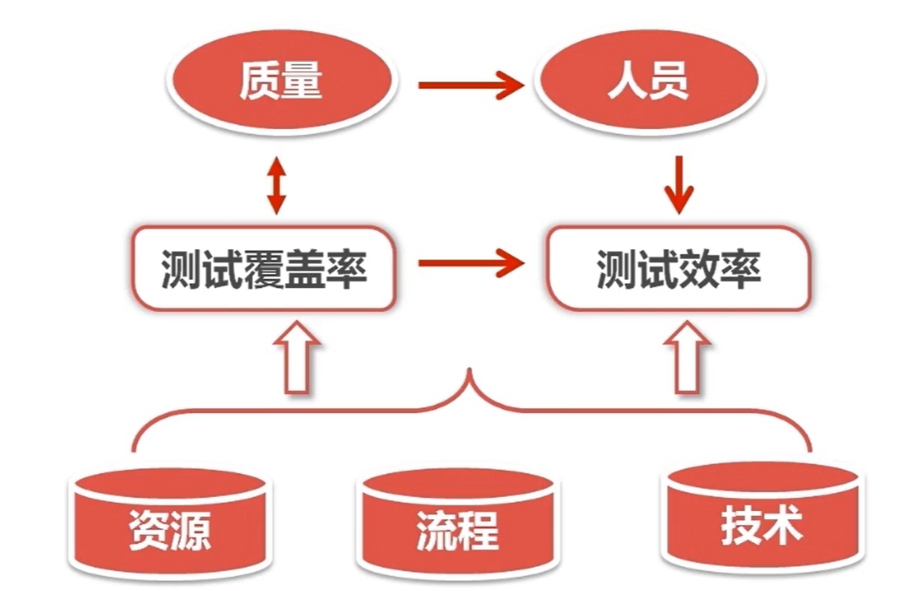
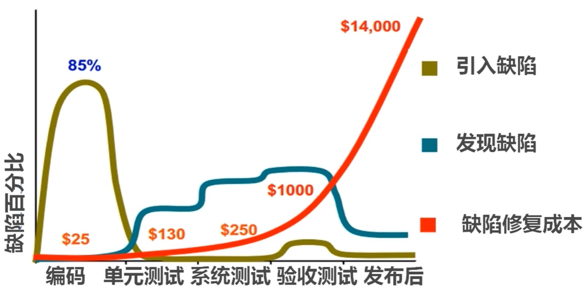

#  你所知道软件测试是这样的吗？

## 那些软件Bug引发的惨案

1. 日本证券公司超过400亿日元损失的bug。
2. 1990年 AT&T公司断网，损失超7500万。
3. 千年虫bug，全球损失超5000亿。

## 软件测试需要学什么

1. 了解软件测试的含义
2. 软件测试遵循的准则
3. 软件测试有哪些分类？分别是什么概念？
4. 何时开始测试？测试方案如何设计？
5. 测试流程是怎样的？怎么提Bug？怎么写报告？
6. 为什么要做自动化？怎么做自动化测试？

## 什么是软件测试？

### 早期定义

软件测试是对程序能够按预期运行建立起的一种信心。

### 经典定义

测试是为发现错误（目的），而执行程序的过程（目的）。

### IEEE定义（ISO/IEC/IEEE 29119）

规范的说：使用人工或自动的**手段**来运行或测量软件系统的过程，以校验软件系统是否满足**规定的要求**，并找出与**预期结果**之间的差异。

## 软件测试的对象

**软件测试 ≠ 程序测试**，软件测试不仅仅是对程序的本身进行测试！

软件测试的测试对象包括：**软件需求、软件概要设计、软件详细设计、软件运行环境、软件源代码、可运行程序。**

## 软件测试的五大要素和两大目标

### 五大要素：

> * **质量**：软件的质量是**最核心**的要素，其他的四个要素都是为软件质量服务的。
> * **人员**：人决定了软件的质量、资源、流程以及技术。
> * **技术**：包括软件**测试技术**、软件**测试方法**、包括我们使用的**工具**。技术是进行软件测试的手段。
> * **流程**：从**测试计划——测试用例——测试的执行、报告**；流程是对软件测试进行一个规范的要求。
> * **资源**：指我们测试环境当中，需要的**设备、网络环境、测试数据（测试周期；测试时间）**。

### 两大目标

**提高软件测试的覆盖率，有效保证软件的质量；提高软件测试效率，更好的完成软件测试。**

## 软件测试所遵循的原则

### 一、测试显示缺陷的存在，但不能证明系统不存在缺陷。

意味着，测试后不能保证以后软件中不会存在缺陷。

###  二、穷尽测试是不可能的，应设定及时终止的条件。

### 三、测试应该尽早进行。

越到软件研发的后期，修复缺陷的成本越高。

最经济的做法是：是在研发的前期发现缺陷，并且把这些缺陷修复。

### 四、缺陷具备群集特性

发现问题多的模块，可能这个模块的质量就越不好，就越需要我们重点关注。这方面跟软件开发人员的编程水平、经验和习惯有很大关系。

### 五、测试的杀虫剂悖论

在测试当中，如果使用相同的测试用例、同样的测试方法，多次重复的测试某一个模块。那么我们将不能再发现新的缺陷。

因此，测试用例需要经常的评审和修改，不断增加不同的测试用例、测试方法来测试软件或系统的不同部分，从而发现更多的软件缺陷。

### 六、测试的二八原则

把80%的时间，用在20%的重点模块上，达到测试的效率，达到资源配置最佳的比例。

### 七、测试活动依赖于测试背景 

商城型的软件，对于并发量性能有很大要求。

金融（比如银行）型的软件，对于安全性要求会更高。