## JMeter之HTTP协议接口性能测试

## jmeter安装工作

[下载地址](https://jmeter.apache.org/download_jmeter.cgi)

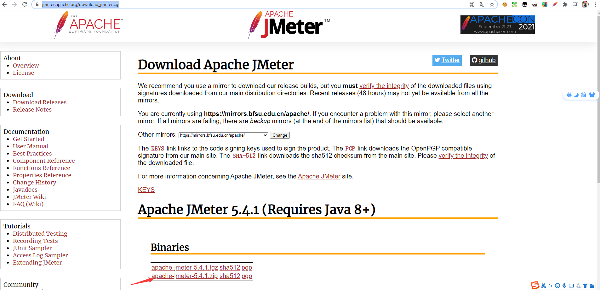

jmeter运行需要java环境，安装jdk1.8即可。

解压下载的jmeter绿色安装包，打开bin目录，windows系统——双击jmeter.bat，等待窗口打开。

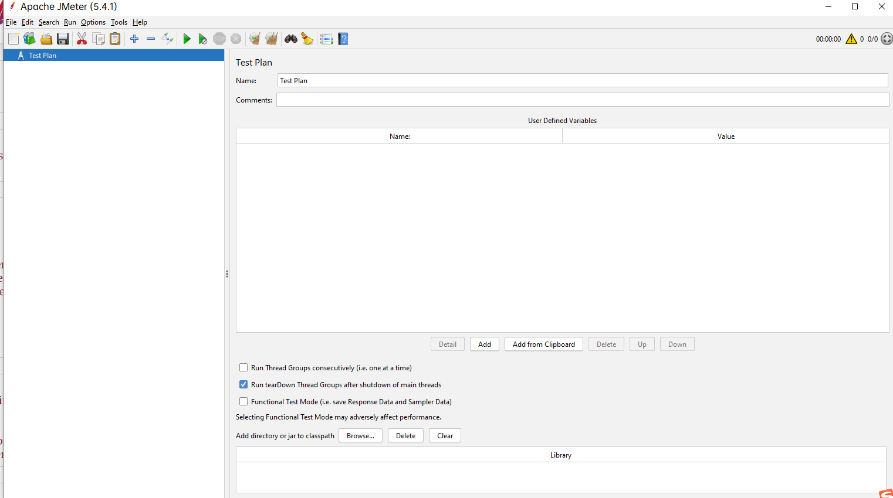

打开后，纯英文，英文一般的同学，点击上方工具栏中的options——choose language——Chinese（simplified），即可切换为中文。

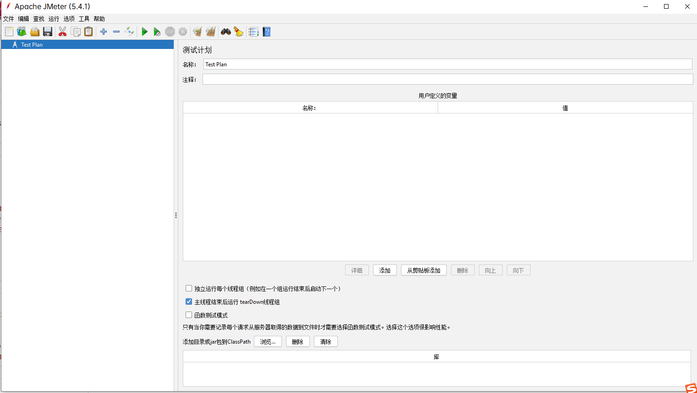

## get请求测试

右键Test Plan ，添加——线程——线程组

右键线程组，添加——取样器——HTTP请求

继续填写Http请求内容——服务器名称、路径、请求协议

如下

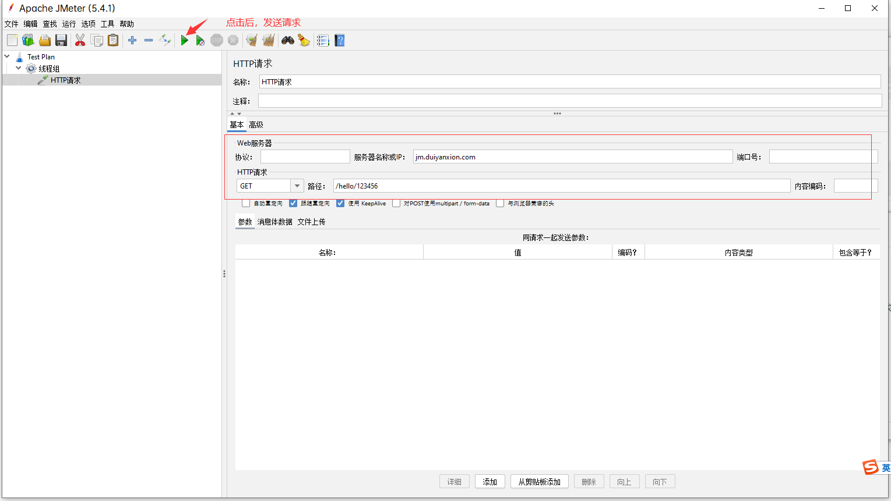

发送请求后，我们发现页面中并没有发生任何变化。没有办法知道http请求返回的结果。怎么办呢？

右键线程组，添加——监听器——察看结果树

再次发送请求，就会发现察看结果树板块中，出现响应的信息。

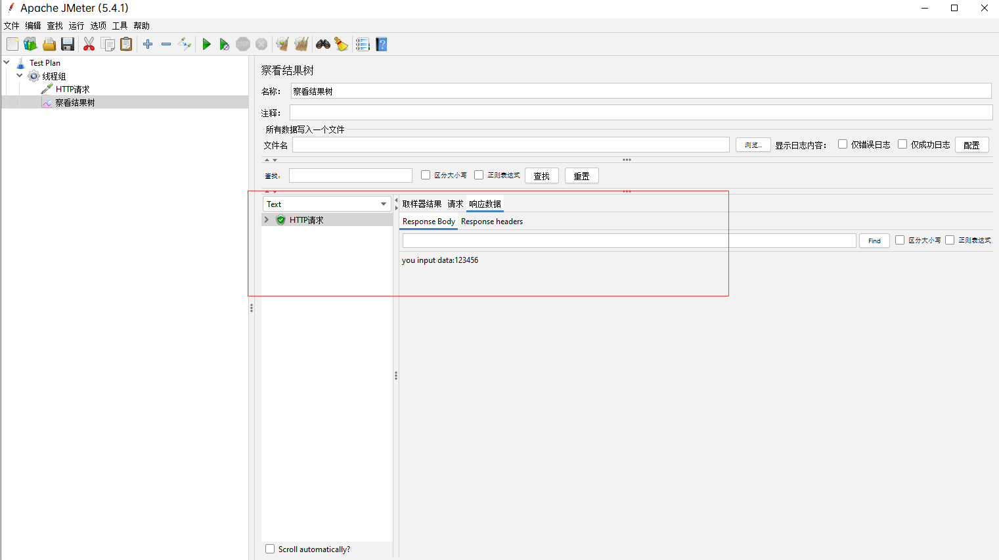

如果需要统计请求的结果，比如响应速度，错误率等。怎么办呢?

右键线程组，添加——监听器——聚合报告

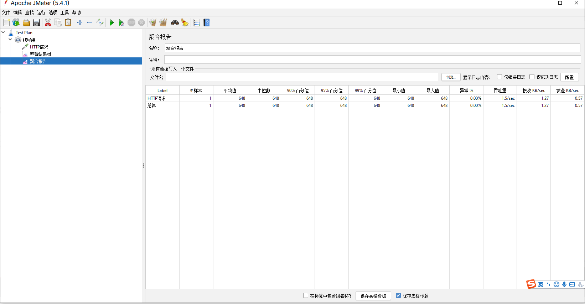

如果需要多个样本，怎么办呢？

点击线程组，修改线程数为你需要的数量。

如果需要同时并发，修改`Ramp-Up时间（秒）`为0。

## 参数化——函数助手

在一些场景中，我们需要读取文件中的内容，去发送请求。怎么办呢？

使用函数助手生成参数，就可以达到我们的需求。

点击工具栏中的，工具——函数助手对话框

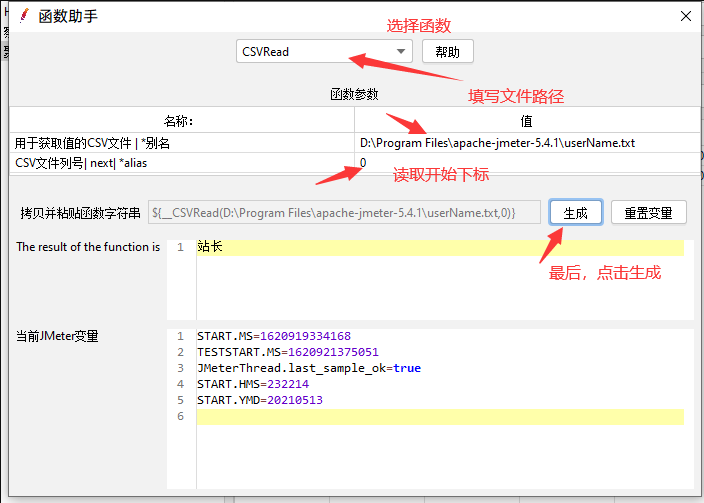

`函数助手`就会把函数字符串生成出来，我们就可以很容易的得到函数。

把生成的函数，可以传递到请求路径后，发送请求。看看效果如何？

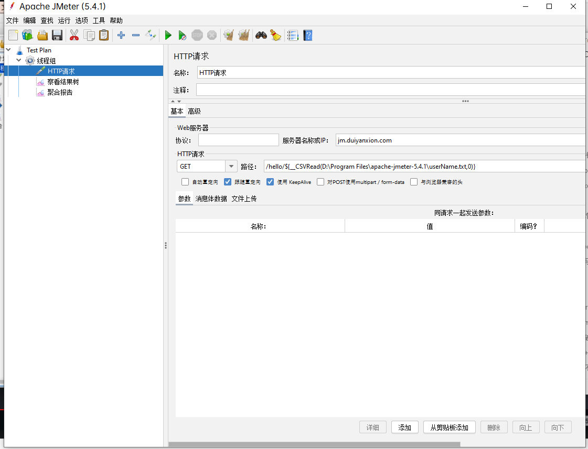

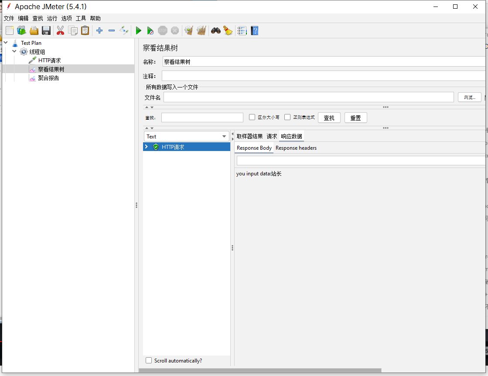

附上userName.txt中的内容

```
站长
zhangsn
hhhhh
lisi
```

我们把线程数调整为5，循环读取文件中的内容，发送请求。

会发现每次请求携带的参数不一样。

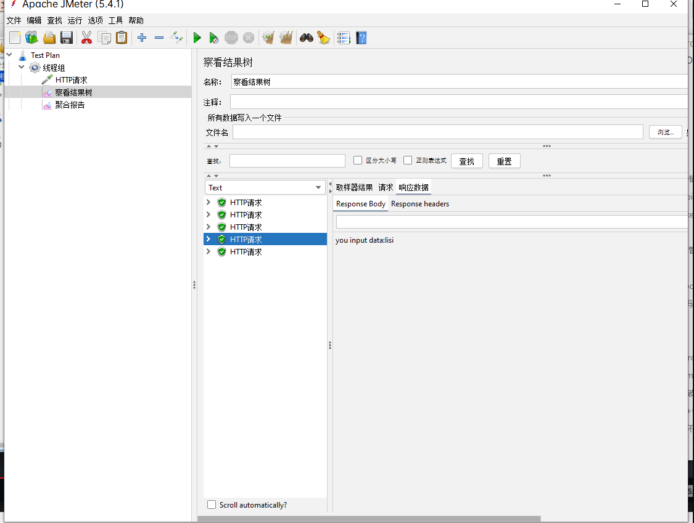

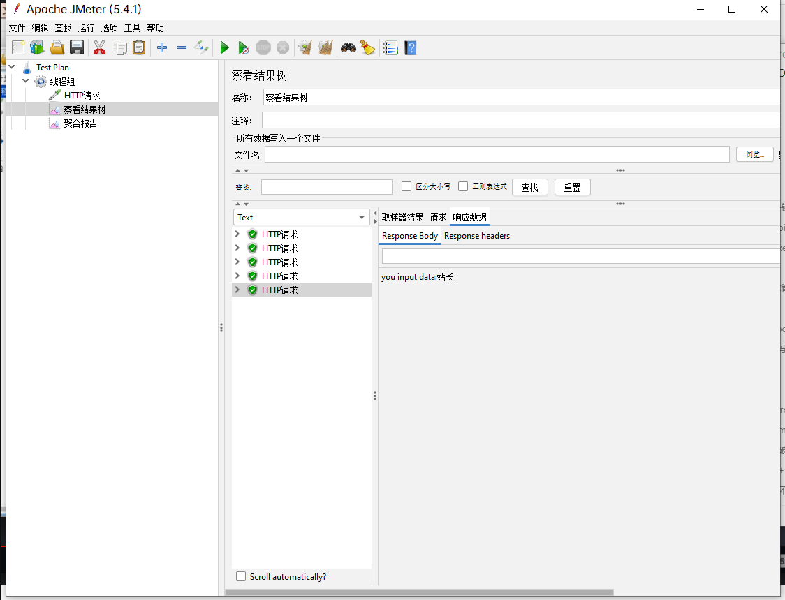

## post请求测试

### map参数格式(key-value)

继续新建HTTP请求

右键线程组——取样器——HTTP请求，

填写HTTP请求配置

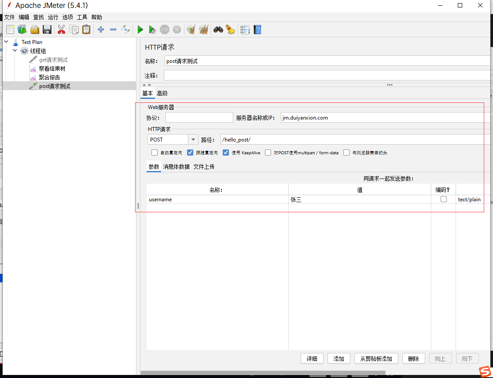

为了防止post和get请求同时触发，我们可以先禁用掉get请求。

右键`get请求测试`，点击禁用即可。

然后发送请求后，察看结果树，是否返回正常。

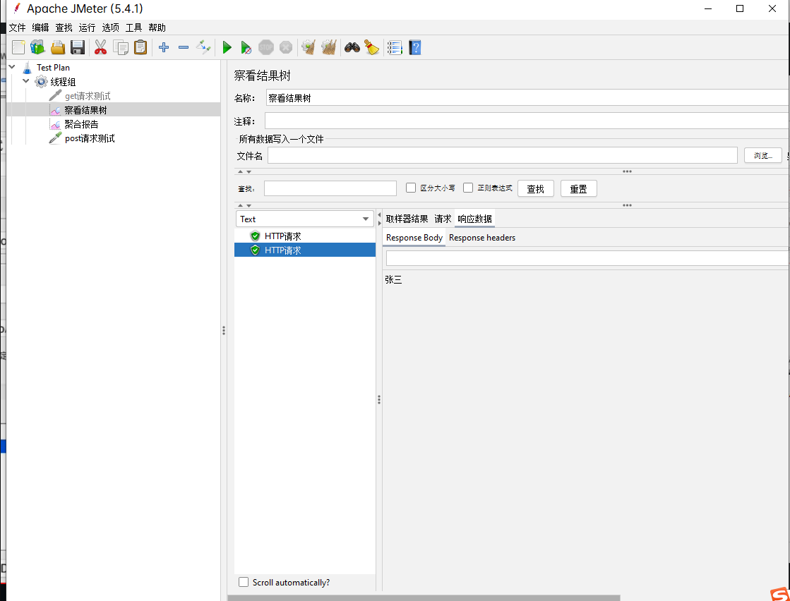

`userName`的赋值也可以使用函数表达式。生成函数后，填写即可。

### json格式参数格式

继续新建一个HTTP请求...我们直接把其他HTTP请求禁用掉，防止触发。

json格式的参数传递的时候，把json内容填写到`消息体数据`中。

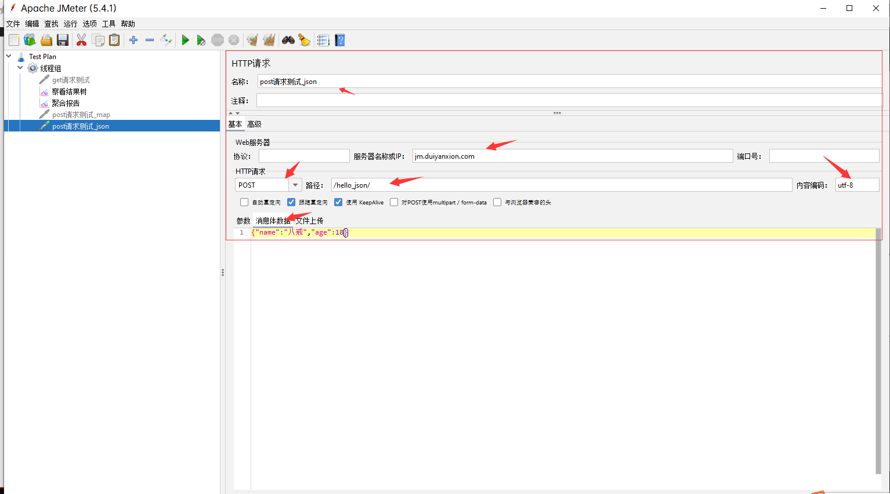

继续设置请求头

点击线程组右键——新建——配置元件——HTTP信息头管理器，

填写`Content-Type:application/json`

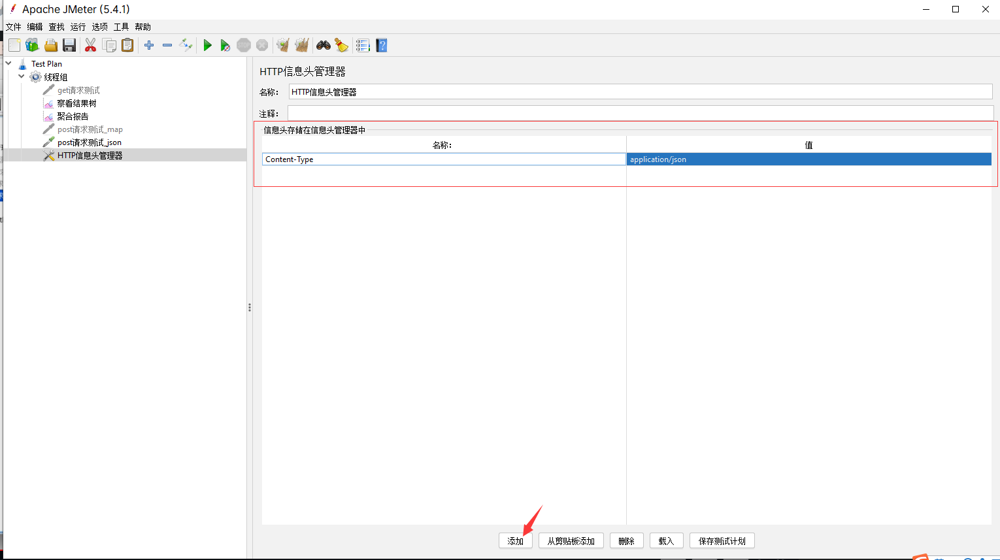

发送请求后，察看结果树

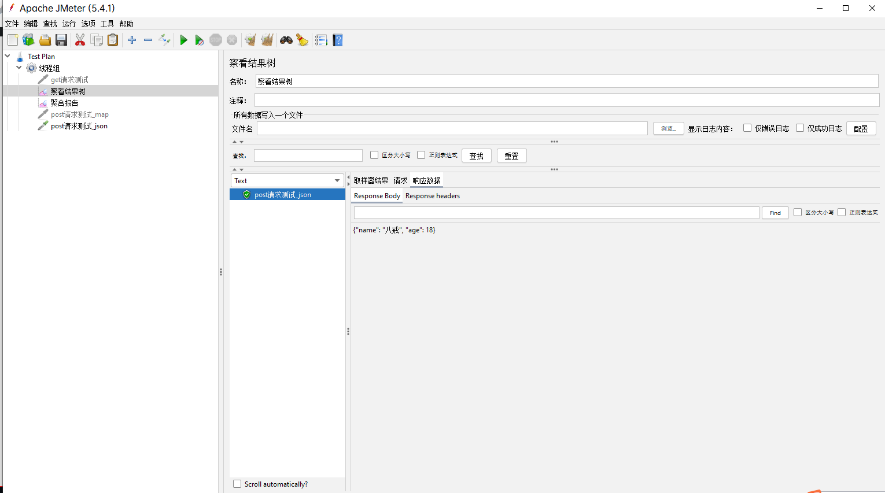

