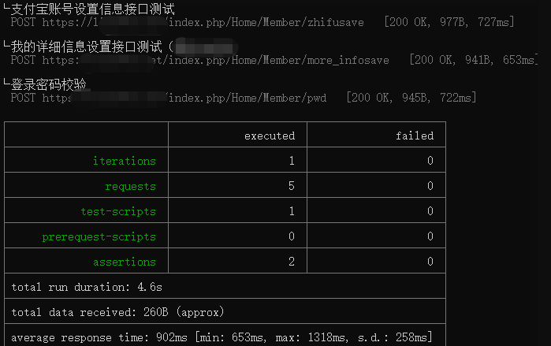
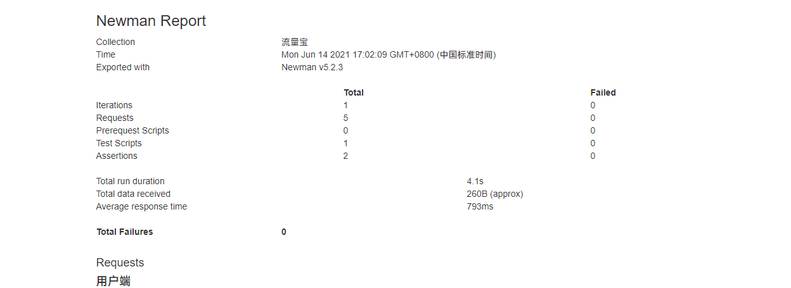
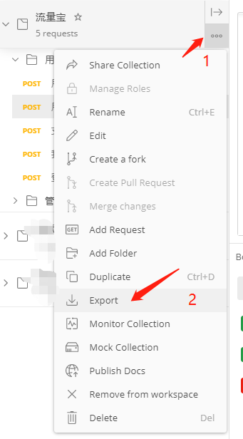
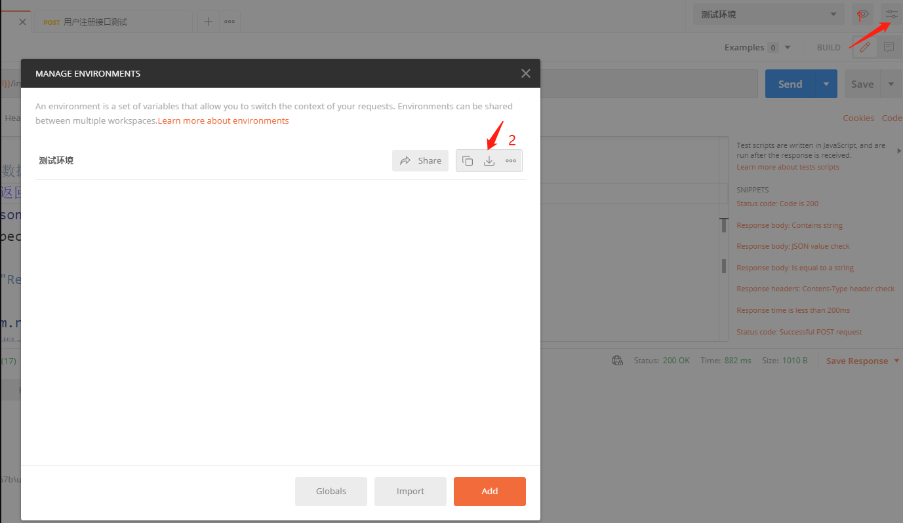

# 使用postman和newman导出接口测试报告

> 工欲善其事必先利其器

Newman需要基于node.js环境才能运行

那我们首先安装node.js环境

安装的过程我就不说了

node.js下载地址

**https://nodejs.org/zh-cn/**

node.js和环境变量设置方法：

https://jingyan.baidu.com/article/64d05a021974acde54f73b70.html

环境搭建好后，打开命令行cmd

```
node -v
```

然后返回版本号了，就安装成功了。

继续安装newman

```
npm install -g newman
```

安装完后，使用命令，验证安装完成。

```
newman --version
```

然后使用命令，就可以运行我们在postman导出的请求集合以及环境变量。

```
newman run llb.postman_collection.json -e llb.postman_environment.json
```

`-e`是设置环境变量

执行后，就可以看出请求的接口、方法、断言结果以及结果统计



但是我们工作中，肯定是需要输出报告的。不可能把命令行窗口截图提交，哈哈

输出测试报告文件，newman支持四种格式的报告文件

1. cli
2. json
3. html
4. junit

就html的报告，看起来一目了然，这也是我们工作中最常使用的。

生成html报告时需要安装html套件，继续安装。

```
npm install -g newman-reporter-html
```

安装完成后，使用命令，就可以导出html的报告了。

```
newman run llb.postman_collection.json -e llb.postman_environment.json   -r html --reporter-html-export  流量宝.html
```

然后在文件夹中，打开html，就可以看到输出的报告了。




最后，我来说一说，postman导出需要测试的数据。



这样就导出需要测试的请求集合。



这样就导出我们的测试环境中使用的环境变量。