# 软件测试实战项目--LiteMall商城电商

为了我对象在软件测试这个行业中，积累到更多的测试经验。这两天我在B站上找到了一个“轻商城”的项目。进去一看，是“黑马程序猿”的课程。

项目是基于web端的，看起来还可以。基本上电商平台的功能模块，里面都有。

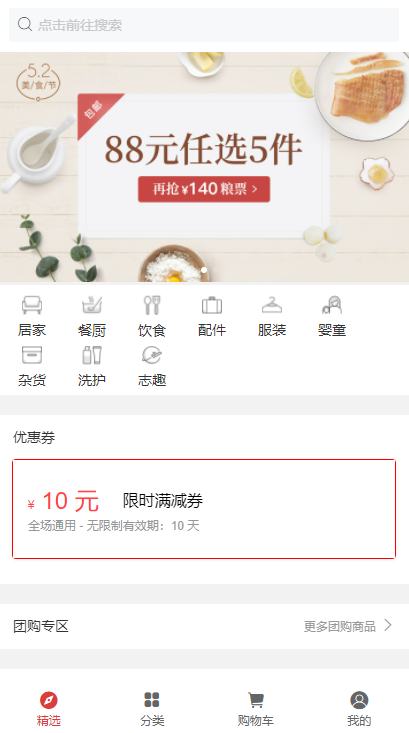

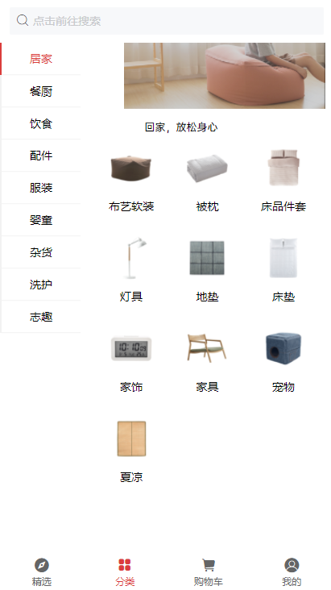

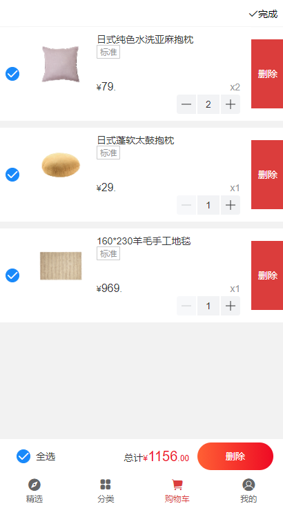

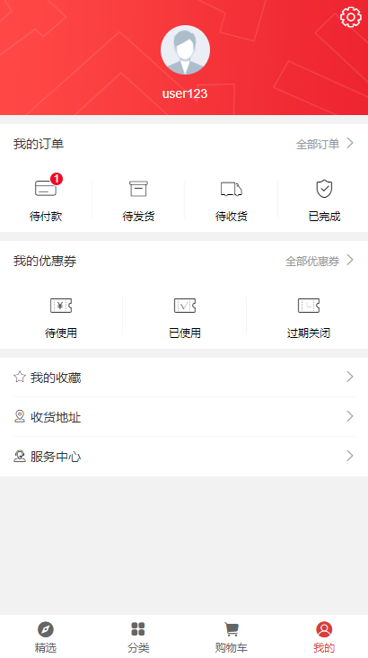

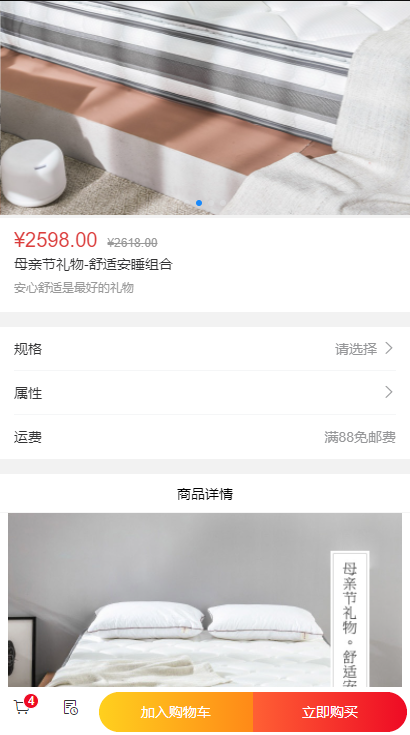

这是我搭建完毕后的，几张演示图。大家觉得怎么样呢？除去UI不怎么美观，该有的功能基本都实现了。

这个项目的源码，我是问黑马培训班的老师要的。不过说实话，如果没有一点linux以及web项目部署经验的同学，想搭建好这个项目，还是有点难度的。除非你去报班，一对一的咨询老师。不过，我可以说是白嫖来的，哈哈

这个项目，真的是，我近年来能在培训班找到几乎完美且完整的第一个项目。因为很多培训班都在玩套路。网上宣发了很多免费的或者几毛钱就能买到的课程视频，都是为了给自己引流的。一般都是课程是免费的，但是课程中的涉及的实战项目都是收费的，只要你通过报班才可以获取到。咱也就不多说了。

继续给大家上几张，后台——管理端的演示图

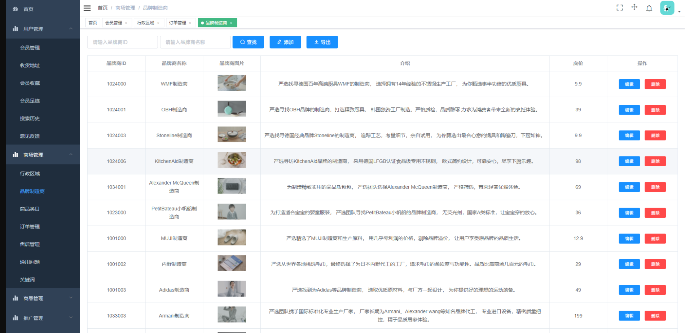

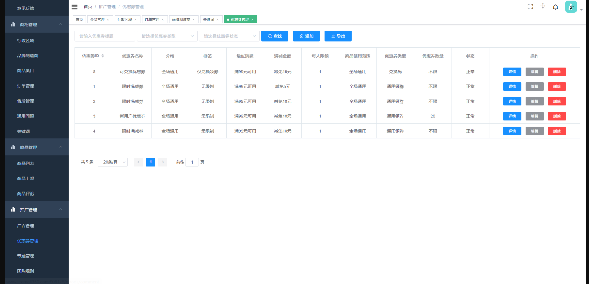

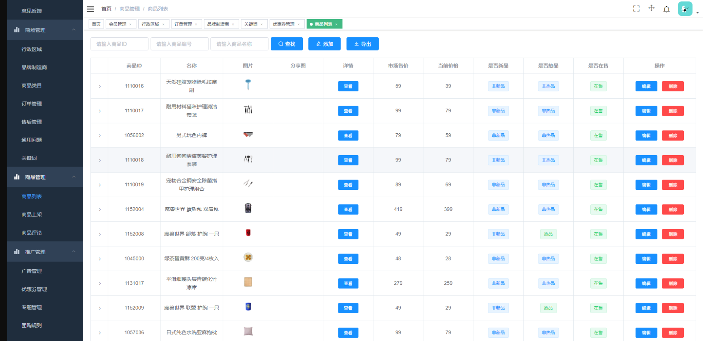

功能也都很完善，基本前台的数据，都是可以通过后台去调整。不需要去数据库里面修改了。很方便。

我在这里，发现了它的[开源地址](https://github.com/linlinjava/litemall)...

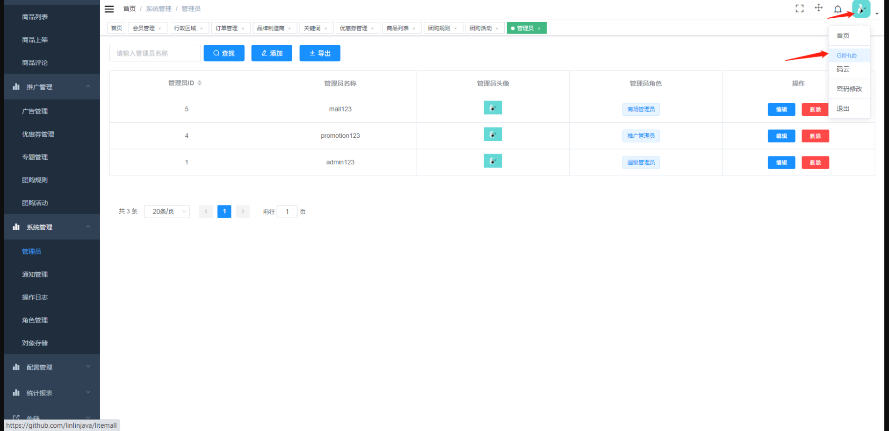

那估计八成是黑马的老师，也是用开源的作者，搭建的项目。应该也不是黑马内部自己开发的了...哈哈

又有了新发现...这商城居然有微信小程序版！

刚好，小程序出来这么多年，热潮一直在。网上也有关于小程序测试方面的教学课件，这么一个现成的项目放在我眼前，不如把它搭建出来。以便后续学习使用。

我继续放几张小程序的演示图，供大家观览。

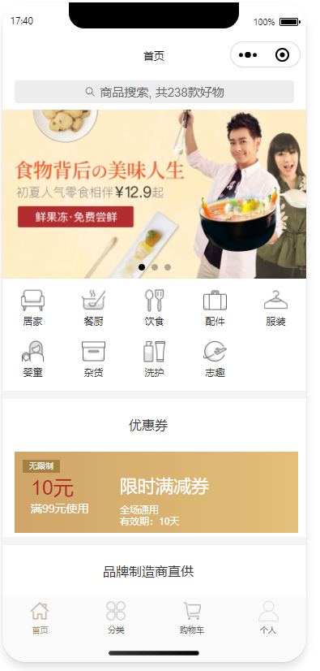

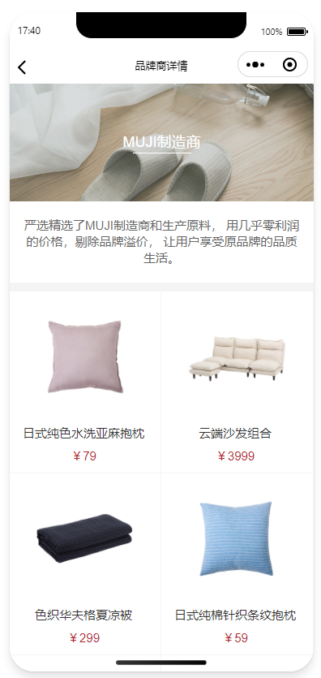

你看，这小程序做的也美美的。web端和小程序端都集齐了，就差APP端了。

最后，附上黑马程序猿，关于轻商城的软件测试课程地址。

https://www.bilibili.com/video/BV1kw411o756?p=19

还有LiteMall项目开源地址

https://github.com/linlinjava/litemall

学习以及从事软件测试行业的同学们，可以下载、学习，自己部署、测试。

这套项目中，有的地方在后台修改不了，我们就只能在数据库中修改。但是我们又不知道数据库的密码，那就只能选择使用“忘记了mysql密码怎么办？”的方案。来修改数据库密码，从而达到修改数据的需求。

渴望一起学习有个伴的同学，可以添加我的微信`iamyangxuea`。快乐星球，我们一起来研究~

如果需要课件中的配套学习资源，可以联系我，免费分享给你哦。