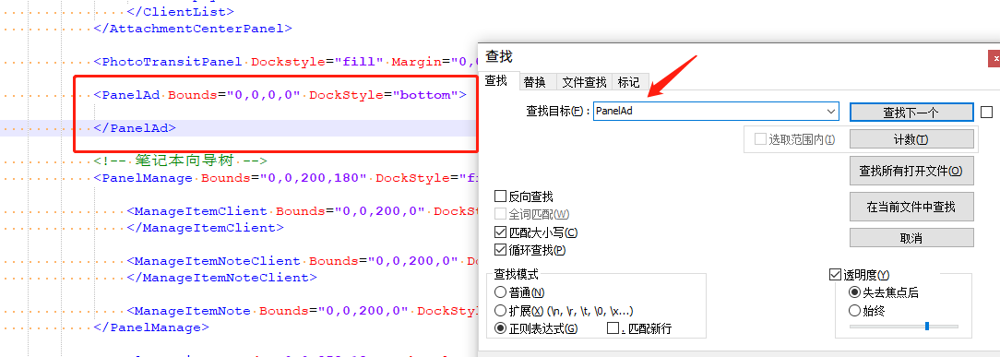
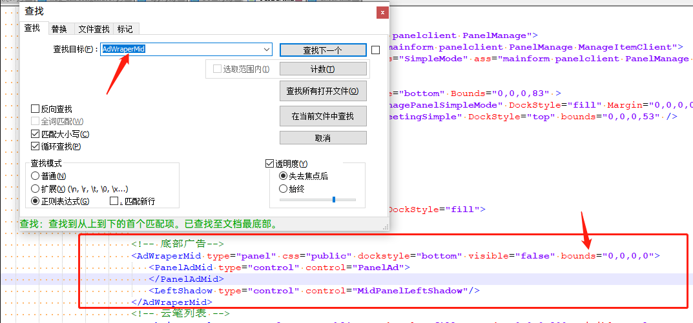

# 有道云笔记屏蔽AD

本人或许有些强迫症，使用的软件若是出现广告，我会直接点击关闭ad，平常的也会在**有道云笔记**和**自己的博客**记录一些东西。在使用，但是无法关闭掉，有道云笔记，弹出的广告。提示只能充值会员才能关闭。

于是开始，我的爬贴之路。

教程开始：

**去广告的原理：**就是将广告版块的大小设置为 0 。

修改安装目录下的skin.xml文件（\Youdao\YoudaoNote\theme\default\skin.xml）：

修改安装目录下的build.xml文件（\Youdao\YoudaoNote\theme\build.xml）：

把，Bounds属性的值都改为，"0,0,0,0"，就可以隐藏掉广告了。

