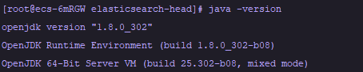
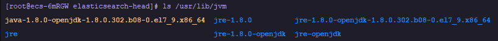
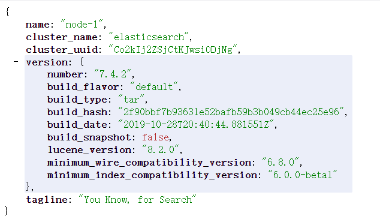
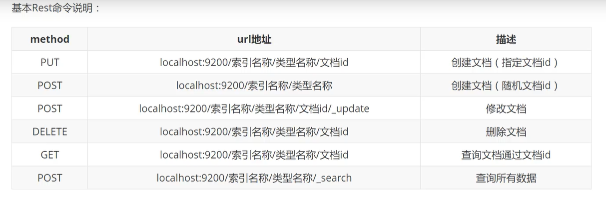
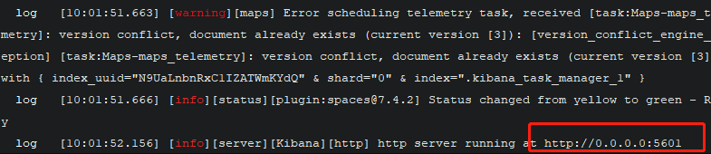
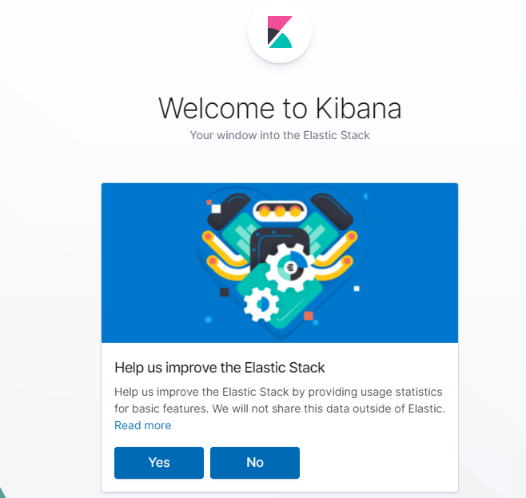
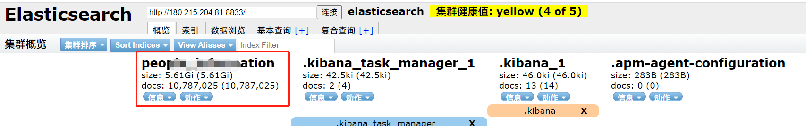

# Linux下安装部署ElasticSearch

ElasticSearch，简称为`es`。es的运行需要jdk环境，我们首先需要安装java。

## java环境篇

### 安装java

```shell
# 安装jdk1.8.0的所有文件
yum install -y java-1.8.0-openjdk*
```

### 检查jdk

安装完成后，检查`jdk`是否安装成功

```shell
java -version
```



接下来，配置环境变量。其实我一直有个疑问，yum安装的java，到底需要配置环境变量吗？其实我没有配置环境变量，也一样可以运行es。这里，我们为了保险起见，还是配置一下吧。

### 配置环境变量

- yum安装jdk默认安装的路径在 `/usr/lib/jvm`

  

- 在`/etc/profile`文件中添加如下命令

  ```yml
  # set java environment  
  JAVA_HOME=/usr/lib/jvm/java-1.8.0-openjdk-1.8.0.181-3.b13.el7_5.x86_64
  PATH=$PATH:$JAVA_HOME/bin  
  CLASSPATH=.:$JAVA_HOME/lib/dt.jar:$JAVA_HOME/lib/tools.jar  
  export JAVA_HOME  CLASSPATH  PATH
  ```

- 保存关闭`profile`文件，执行如下命令生效

  ```shell
  source /etc/profile
  ```

- 使用如下命令，查看`jdk`变量

  ```shell
   echo $JAVA_HOME
   echo $PATH
   echo $CLASSPATH
  ```

  输出变量值，则成功。

以上是最简单粗暴的安装java-jdk方式。

## ES篇

### 安装es

你可以去官网下载

https://www.elastic.co/cn/downloads/elasticsearch

如果你觉得下载速度比较慢，可以用一些国内的镜像站。比如`华为开源镜像站`。

https://repo.huaweicloud.com/elasticsearch/

针对自己的情况选择即可。

- 下载完成后，解压

```shell
tar -xvf elasticsearch-xxxxxx.tar.gz
```

- 修改配置文件`config/elasticsearch.yml`

```yml
//添加 下面几行
xpack.ml.enabled: false
network.host: 0.0.0.0
# 开放端口
http.port: 8833

#memory
bootstrap.memory_lock: false
bootstrap.system_call_filter: false

#node
node.name: node-1 
cluster.initial_master_nodes: ["node-1"]

```

- 修改配置文件`config/jvm.options`

```yml
//修改为，128m  不然本机1G的运行内存 用不了
-Xms128m
-Xmx128m
```

这里最大、小运行内存，具体看你服务器的配置和你的数据量。我配置比较高，我设置的4G。4*1024=4096m

- 添加linux子用户，启用es

  因为root用户下，无法启用es的。所以只能创建一个es的子用户。

  ```shell
  # 根目录下创建用户，密码
  useradd es
  # 设置密码
  passwd es
  ```

  

- 给与文件访问权限

  你必须给与es权限，不然他没有es文件夹下的启用权限，就会报错。

  ```shell
  chown -R es:es /www/software/elasticsearch
  ```

  - 打开 `/etc/security/limits.conf `，在里面添加如下内容

    ```shell
    * soft nofile 65536
    * hard nofile 65536
    ```

  - 修改 `/etc/sysctl.conf`，末尾添加下面配置

    ```shell
    vm.max_map_count=655360
    ```

  - 查看并更新生效

    ```shell
    sysctl -p 
    ```

### 启用es

使用`es`账号登录，启动es

```shell
su es
cd /www/software/elasticsearch
# 启动es
./bin/elasticsearch&
```

### 访问es 

打开浏览器，或者`curl`访问

http://localhost:8833/

或者http://外网ip:8833



这样就启动OK了

### 基本Rest命令说明



## 插件篇

### 安装ElasticSearch Head插件

```shell
cd /www/software/elasticsearch
# 拉取文件
git clone git://github.com/mobz/elasticsearch-head.git
# 安装依赖
cd elasticsearch-head
npm install
npm run start
```

- 修改默认端口号

  - 访问es-head端口号

    打开文件  `elasticsearch-head/Gruntfile.js`

    ```js
    connect: {
    			server: {
    				options: {
    					port: 9100, //默认端口9100 修改自己的
    					base: '.',
    					keepalive: true
    				}
    			}
    		}
    ```

  - 修改es-head插件访问es的端口号

    打开`elasticsearch-head/_site/app.js`

    ```js
    this.base_uri = this.config.base_uri || this.prefs.get("app-base_uri") || "http://localhost:9200"; 
    
    ```

  - 修改es配置文件 `config/elasticsearch.yml`

    ```yml
    //末尾添加 处理跨域和运行
    http.cors.enabled: true  
    http.cors.allow-origin: "*"
    ```

    保存后，需要重新启动es。才可生效

    ```shell
    ./bin/elasticsearch
    ```

    

修改完后，重启es-head即可生效

```shell
npm run restart
```

### 访问Head插件地址

打开浏览器访问

http://localhost:8834

或者 http://外网ip:8834


如果集群健康值，不为：红色或者灰色就OK了

如果你没有npm环境，就需要安装喽~

## npm篇

### 安装npm

我直接使用yum安装，很方便很粗暴

- 安装

  ```shell
  curl --silent --location https://rpm.nodesource.com/setup_10.x | bash -
  
  yum install -y nodejs
  
  ## 设置淘宝镜像，速度快
  npm install -g cnpm --registry=https://registry.npm.taobao.org
  
  npm install
  # 安装完成，查看版本号
  npm -v
  ```

- npm 升级

  ```shell
  # 安装npm升级工具
  npm install -g n
   
  # 安装最近的稳定版本
  n stable
  ```

  这样就OK了


如果你需要把es-head插件一直在后台运行，那可以借助`nohup`、`screen`这样工具，防止断开ssh后，进程被杀死。

也可以使用`pm2`进程管理器，保持进程一直活着。

## 进程管理篇

### 安装pm2

- 安装

  ```shell
  npm install -g pm2
  ```

- 运行

  ```shell
  # 启动一个进程并把它命名为 es-head
  pm2 start npm --name es-head -- start
  ```

  > 其他运行方式：
  >
  > ```shell
  > pm2 start app.js -i max  # 根据有效CPU数目启动最大进程数目
  > pm2 start app.js -i 3      # 启动3个进程
  > pm2 start app.js -x        #用fork模式启动 app.js 而不是使用 cluster
  > pm2 start app.js -x -- -a 23   # 用fork模式启动 app.js 并且传递参数 (-a 23)
  > pm2 start app.js --name serverone  # 启动一个进程并把它命名为 serverone
  > pm2 stop serverone       # 停止 serverone 进程
  > pm2 start app.json        # 启动进程, 在 app.json里设置选项
  > pm2 start app.js -i max -- -a 23                   #在--之后给 app.js 传递参数
  > pm2 start app.js -i max -e err.log -o out.log  # 启动 并 生成一个配置文件，你也可以执行用其他语言编写的app  ( fork 模式):
  > pm2 start my-bash-script.sh    -x --interpreter bash
  > pm2 start my-python-script.py -x --interpreter python
  > 
  > ```
  >
  > 使用命令
  >
  > ```shell
  > npm install pm2 -g     # 命令行安装 pm2 
  > pm2 start app.js -i 4 #后台运行pm2，启动4个app.js 
  >                               # 也可以把'max' 参数传递给 start
  >                               # 正确的进程数目依赖于Cpu的核心数目
  > pm2 start app.js --name my-api # 命名进程
  > pm2 list               # 显示所有进程状态
  > pm2 monit              # 监视所有进程
  > pm2 logs               #  显示所有进程日志
  > pm2 stop all           # 停止所有进程
  > pm2 restart all        # 重启所有进程
  > pm2 reload all         # 0秒停机重载进程 (用于 NETWORKED 进程)
  > pm2 stop 0             # 停止指定的进程
  > pm2 restart 0          # 重启指定的进程
  > pm2 startup            # 产生 init 脚本 保持进程活着
  > pm2 web                # 运行健壮的 computer API endpoint (http://localhost:9615)
  > pm2 delete 0           # 杀死指定的进程
  > pm2 delete all         # 杀死全部进程
  > ```


## kibana篇

Kibana是世界上最受欢迎的开源日志分析平台ELK Stack中的“K”，它为用户提供了一个工具，用于在存储于Elasticsearch集群中的日志数据进行检索，可视化和构建仪表板。

### 安装kibana

先下载

```shell
wget http://xxxxx
```

如果你想体验极速下载，还是一样去华为镜像站下载。

然后解压

### 修改配置文件

```shell
cd kibana/config
vim kibana.yml
# 需要修改的配置项
# kibana服务端口
server.port:5601
# 如果你想公网访问，需做以下配置
server.host: "0.0.0.0"
# elasticsearch访问端口
elasticsearch.hosts: ["http://localhost:8833"]
```

我在安装的时候，报了以下错误。

```
Error registering Kibana Privileges with Elasticsearch for kibana-.kibana
```

爬了一些帖子，也没有找到头绪。只是让关闭kibana的xpack。

```yml
# 继续在kibana.yml中，添加如下配置。
# 禁用X-Pack图形功能
xpack.graph.enabled: false
# 禁用X-Pack机器学习功能
xpack.ml.enabled: false
# 禁用X-Pack监视功能
xpack.monitoring.enabled: false
# 禁用X-Pack报告功能
xpack.reporting.enabled: false
# 禁用X-Pack安全功能
xpack.security.enabled: false
# 禁用X-Pack观察器功能
xpack.watcher.enabled: false
```

### 启动kibana

切换到`kibana/bin目录`，启动kibana。

```shell
./kibana
```

看到控制台输出如下，就OK了。




使用浏览器访问http://外网ip:5601，



### 汉化kibana

kibana 一直是 日志分析 中得力的助手，`kibana 7.x` 中官方加入了中文的选项。

只需要在配置文件 `kibana.yml` 中加入

```yml
i18n.locale: "zh-CN"
```

就可以了。

不得不说，对于我这英语菜的人来说，简直是福音。


### 关闭kibana

使用 `netstat -tunlp|grep 5601` 就可以查到进程id 了。

然后使用`kill`关闭即可。

## Logstash篇

`Logstash`是一个开源的服务器端数据处理管道，可以同时从多个数据源获取数据，并对其进行转换，然后将其发送到你最喜欢的“存储”。

下载这里，我就不说了，同上。

先准备好你的数据集，然后把数据集放到logstash目录下的`logstash-datas`中。如果没有`logstash-datas`文件夹，可以创建后再放入。

logstash不那么可视化，用起来感觉有点不爽，需要自己编写操作数据的脚本...

我给大家提供一个很基础的脚本，脚本中的内容需要根据你自己的目录修改一下。

```shell
vim logstash.conf
# 输入的内容
input {
  file {
    # 数据集
    path => "/home/xiaowen/logstash-7.4.2/logstash-datas/movies.csv"
    start_position => "beginning"
    # 数据集导入日志存储地址
    sincedb_path => "/home/xiaowen/logstash-7.4.2/logstash-datas/db_path.log"
  }
}
```

然后调用logstash，开始导入数据集到`es`中

```shell
./logstash -f ../config/logstash.conf
```

回车后，我们会看到屏幕哗哗哗的输出很多json数据集。如果数据集比较庞大，我们需要稍等一会。如果看到屏幕不再输出字符了，我们使用`ctrl+c`结束脚本。

如果导入的数据非常多，我们又担心`ssh`会断开，可以先`screen`一个会话，然后导入数据。

导入完成后，可以用`es-head`查看导入情况。




我们可以通过`kibana`去对es中的数据进行增删改查操作。

我最近有个项目是基于`thinkphp`的，后续我会总结一波关于`ElasticSearch在thinkphp5中的使用`。以及`MySQL数据以全量和增量方式，同步到ES搜索引擎中`。

## 总结

如果你搭建成功后，无法在外网访问。可以通过`放行端口`的方式解决。

**以下主机商必看（开端口教程，不开不能用）：**

腾讯云：https://www.bt.cn/bbs/thread-1229-1-1.html 

阿里云：https://www.bt.cn/bbs/thread-2897-1-1.html 

华为云：https://www.bt.cn/bbs/thread-3923-1-1.html 

照猫画虎，照葫芦画瓢，你用什么端口，就放行什么端口，就OK了。

